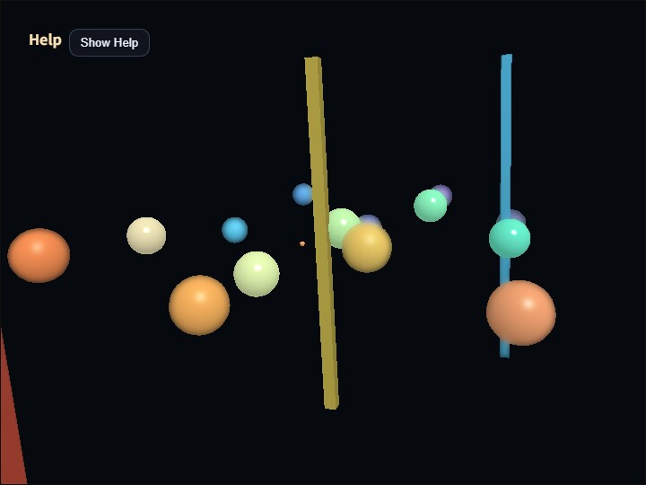

# dof

English | [日本語](README.md)

## Overview
- This is a minimal depth-of-field sample that uses `DofPass` to render the 3D scene once into an offscreen `RenderTarget`, then reads depth and keeps only the focus plane sharp
- It is also a sample for confirming that `SeparableBlurPass` can be reused for purposes other than bloom
- `WebgApp` is used for startup and overlay display, while the main 3D scene switches to postprocess-based drawing with `autoDrawScene: false`
- The sceneTarget used as the blur source keeps the normal forward-rendered scene color, including direct-light diffuse and specular. This avoids the unnatural case where only the specular highlight disappears as soon as the result switches to a blurred image.
- Instead of a floor, many small spheres are placed at near, focus-adjacent, and far distances so the movement of the focus plane can be recognized more easily
- A small cross-shaped guide is placed inside the 3D scene at the current `focusDistance`, making it easier to track the focus-plane position without opening a debug view
- In the CommandPalette, Focus Range follows the same meaning as `compute_dof`: it is the distance width of one blur stage. `DofPass` uses this stage-width rule and moves from scene color to small / medium / large blur in order, so it is less likely to jump to a strong blur immediately after leaving the focus plane
- By default, the sample uses Staged mode, where small / medium / large staged blur textures are selected gradually from the depth difference. This is the sample's standard path
- The three staged blur textures are not generated at the same resolution. `small` uses the base blur scale, `medium` uses about 0.7x of that target size, and `large` uses about 0.5x. This reduces fill cost where large blur would dominate while keeping the appearance stable
- The default blur iterations for small / medium / large are `1 / 2 / 4`. Smaller blur stages gain little visible quality from extra iterations, so each stage uses only the amount of repetition it needs
- The benchmark page in the CommandPalette can run an automatic sequence for `DOF Off / Staged S1 / Staged S2 / Staged Full / Staged Half`, then download the averaged values and per-frame samples as JSON. `Staged S1` uses only the small blur stage, and `Staged S2` uses small + medium. During measurement, the view is fixed to `composite` so the comparison stays on the same output flow
- Use CommandPalette Background to switch the clear color and compare bloom-like leakage that stands out on black backgrounds with edge appearance on brighter backgrounds
- The default values are tuned for a practical light blur that is easy to compare with `compute_dof`: the CommandPalette shows `focusRange=7.0`, `Focus Hold=0.35`, `maxBlurMix=1.0`, full quality, stage blur iterations `1 / 2 / 4`, and `blurRadius=2.0`
- The sphere geometry is built from a unit sphere only once, and each node expresses radius differences through a `Shape` instance and uniform scale, avoiding duplicated mesh builds while changing only color
- The operation guide and load display are shown in a collapsible help panel at the upper left with `buildHelpPanelOptions()` and `showOverlayPanel()`, while current DoF settings are shown directly on CommandPalette toggles, steppers, and selectors

## How to Run
- Open [./dof.html](./dof.html)
- Use a browser with WebGPU support, and check the help panel and CommandPalette together with the sample when needed
- Open the CommandPalette by double tapping the canvas or pressing `/`. You can change background, focus distance, focus range, blur radius, and per-stage iterations while seeing their current values. The help panel also shows frame timing, so the appearance and load can be compared on the same screen.

## webg Features Used
- `WebgApp`: initialization of `Screen / Shader / Space / Input / Message` and overlay display
- `buildHelpPanelOptions() + showOverlayPanel()`: builds the standard help panel at the upper left and toggles the visibility of the operation guide
- `CommandPalette`: provides a settings panel opened by double tapping the canvas or pressing `/`, and lets the sample show and edit current DoF values in place
- `Shape.createInstance()`: reuses the shared resource of the unit sphere and places spheres of different colors with individual material and node scale
- `RenderTarget(sampleDepth=true)`: offscreen render target whose color and depth can be read by later passes
- `EyeRig(type="orbit")`: orbit viewpoint for inspecting the depth layout

## Instancing Measurements
- Before instancing
- `vertexCount=12252`
- `triangleCount=22436`
- `boneCount=0`
- `nodeCount=27`
- `shapeCount=23`
- `meshCount=23`
- After instancing
- `vertexCount=681`
- `triangleCount=1156`
- `boneCount=0`
- `nodeCount=27`
- `shapeCount=23`
- `meshCount=4`
- `shapeCount` does not change because the number of spheres placed in the scene itself is the same
- `meshCount`, `vertexCount`, and `triangleCount` decrease greatly because the unit-sphere geometry is built only once and its shared resource is reused by multiple `Shape` instances

## Checkpoints
- Toggle DOF on and off with the CommandPalette DOF toggle and confirm that spheres farther from the focus plane become more blurred
- Confirm that even when the camera rotates, the view is not blocked by a floor and multiple small spheres remain visible as front-to-back layers
- When changing `Focus Dist` with the CommandPalette, confirm that the depth band that appears sharp moves forward and backward
- When changing `Focus Dist` with the CommandPalette, confirm that the cross guide inside the 3D scene also moves forward and backward to the same distance
- Confirm that the help panel appears at the upper left, that pressing `Hide Help` leaves only the `Show Help` button, and that `Show Help` restores it
- When changing `Focus Range` with the CommandPalette, confirm that the distance width of one blur stage becomes narrower or wider
- When changing `Blur Radius` or per-stage iterations with the CommandPalette, confirm how the bleed outside the focus area and GPU load change
- When changing `Max Blur` with the CommandPalette, confirm how strongly blur is mixed back into the scene
- When switching blur quality between full and half with CommandPalette `Quality`, confirm how the small / medium / large blur target sizes all change together and how that affects final appearance and GPU load
- When switching `Stage Cnt` between `1 / 2 / 3`, confirm how the number of staged blur levels changes both the appearance and the GPU load
- On the benchmark page in the CommandPalette, adjust `Warmup` and `Samples`, run `Bench`, and confirm that the result can be saved from `JSON`
- Use CommandPalette `View` to switch between `composite / scene / depth / focusMask / stageMask / blurSmall / blurMedium / blurLarge` and confirm that the depth distribution, focus-plane mask, selected blur stage, and each blur texture can be inspected directly
- `focusMask` uses the same color coding as `compute_dof`: focus is 0, foreground stages are -1 / -2 / -3, and background stages are 1 / 2 / 3
- In `stageMask`, scene / small / medium / large are shown in distinct colors so the selected blur stage can be recognized directly
- Switch CommandPalette `Background` and confirm how the clear color changes blur leakage and focus-edge appearance

## Controls
- `Hide Help / Show Help` in the upper-left help panel: show or hide the operation-guide body text
- Double tap the canvas or press `/`: show or hide the CommandPalette
- Drag / arrow keys: orbit camera rotation
- Mouse wheel / `[ / ]`: zoom
- CommandPalette page 1: DOF on/off, Staged, Focus Dist, Focus Range, Focus Hold. Focus Range is the distance width of one blur stage
- CommandPalette page 2: Blur Radius, Max Blur
- CommandPalette page 3: View, Background, Quality, Small Iter, Medium Iter, Large Iter, Stage Cnt, Curve, Reset
- CommandPalette page 4: Bench, JSON, Warmup, Samples
