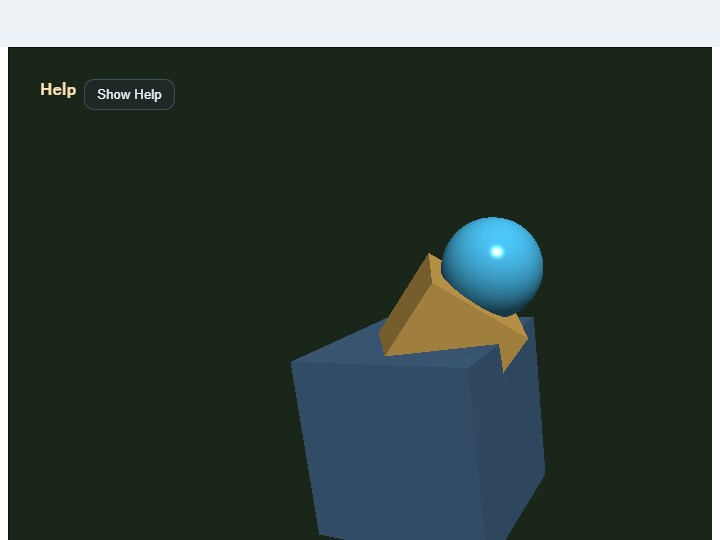

# embedded_glb_viewer

English | [日本語](README.md)

## Overview
- This sample runs a `.glb` viewer inside a canvas embedded in the middle of the page by using `WebgApp` with `layoutMode: "embedded"` and `fixedCanvasSize`
- A single `.glb` selected through `input[type=file]` is loaded through `WebgApp.loadModel()`, and can then be inspected with `EyeRig(type="orbit")` through drag / pinch / keyboard control, the viewer's touch orbit / zoom buttons, and CommandPalette viewer actions
- The loaded model is positioned so the center of its bounding box comes to the world origin, and the camera target also starts from the origin
- Pressing `Load bundled sample` shows the included `samples/gltf_loader/hand.glb` directly, so you can confirm the behavior of the embedded viewer immediately even when you do not have a model at hand
- Touch controls are added through `InputController.installTouchControls()`, wiring `← / → / ↑ / ↓ / + / -` as orbit / zoom step actions and `R / || / W / S` as viewer actions
- `W`, the DOM `W` button, touch `W`, and the CommandPalette Wire toggle all switch wireframe for every displayed shape at once
- Pan follows the standard `EyeRig` interaction, and `Shift + Drag`, `Shift + Arrow`, and two-finger drag move the target along screen directions
- During loading, `showOverlayPanel({ format: "pre", ... })` displays the current stage and elapsed time on the canvas, while the Help Panel and right-side status show the file name, triangle count, clip count, camera state, and errors

## How to Run
- Open [./embedded_glb_viewer.html](./embedded_glb_viewer.html)
- Use a browser with WebGPU support, and check the Help Panel and CommandPalette together with the sample when needed

## webg Features Used
- `WebgApp`: standard initialization for `Screen / Shader / Space / Input / Message / overlay`
- `EyeRig(type="orbit")`: orbit camera driven by drag / wheel / pinch / keyboard
- `WebgApp.loadModel(..., { format: "gltf" })`: the glTF / GLB loader path
- `InputController.installTouchControls()`: touch buttons for coarse-pointer devices
- `CommandPalette`: groups load sample / clear / reset / pause / wireframe / screenshot in a canvas palette
- `WebgApp.showOverlayPanel()`: stage display during loading
- `WebgApp.takeScreenshot()`: saves the current canvas

## Checkpoints
- When choosing a `.glb` from `Choose GLB`, confirm that loading starts immediately and the model appears after loading finishes
- With `Load bundled sample`, confirm that `hand.glb` is displayed and that for animated models `Space` or touch `||` can pause / resume playback
- Right after loading, confirm that the model center is moved to the world origin and that the Help Panel target starts at `0, 0, 0`
- Confirm that drag, pinch, arrows, `[ ]`, and touch `← / → / ↑ / ↓ / + / -` all operate the same orbit camera, and that each tap on the touch buttons responds reliably
- Confirm that `Shift + Drag`, `Shift + Arrow`, and two-finger drag move the view target naturally in screen directions
- Confirm that toggling `W` switches the whole displayed model between solid and wireframe
- Confirm that `R` or `Reset view` returns the camera to the initial framing
- Confirm that `S` or touch `S` saves the current canvas
- Confirm that `/` or double tapping the canvas opens the CommandPalette and can run Load / Clear / Reset / Pause / Wire / Shot

## Controls
- `Choose GLB`: choose a local `.glb` file
- `Load bundled sample`: load the bundled `hand.glb`
- Drag: orbit camera
- Two-finger drag: pan the camera
- Pinch / mouse wheel / `[ ]` / touch `+ -`: zoom
- Arrow / touch `← → ↑ ↓`: orbit camera
- `Shift + Drag / Shift + Arrow`: pan the camera
- `W / DOM W / touch W`: toggle wireframe
- `R / touch R`: reset the camera
- `Space / touch ||`: pause / resume animation
- `S / DOM S / touch S`: save a screenshot
- `Clear`: hide the current model and return to the placeholder display
- `/` or double tap the canvas: open the CommandPalette
