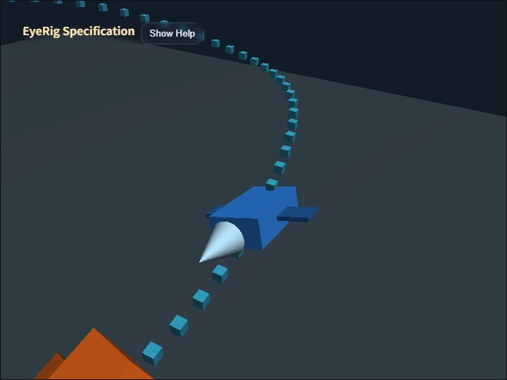

# eye_rig

[English](README.en.md) | 日本語

## 概要

このサンプルは、`base -> rod -> eye` の3段構成を使うEyeRigについて、Orbit、First Person、Followの役割と、アプリケーションが作る親子階層の違いを同じシーンで確認するものです。

青いcamera vehicleとオレンジ色のtarget vehicleは、カーブ、上り下り、bankを含む同じtrackを位相をずらして走ります。OrbitとFirst Personではcamera vehicleを基準としたカメラ配置を確認し、Followではcamera vehicleに取り付けたカメラが、別に動くtarget vehicleへ視線だけを滑らかに向け続けることを確認します。

このサンプルで確認した仕様は `webg/EyeRig.js` へ取り込まれています。サンプルはコアの `EyeRig` を直接使い、Follow、回転した親の下でのOrbit座標変換、First Personの独立lookYaw入力をまとめて確認します。

## 実行方法

- 実行ファイルは [./eye_rig.html](./eye_rig.html) です
- WebGPU対応ブラウザで開き、左上のHelp panelで操作説明と現在値を確認します
- `/` またはcanvasのダブルタップでCommandPaletteを開き、modeや設定を変更します

## 使用しているwebg機能

- `WebgApp`: Screen、Space、camera rig、InputController、Message、OverlayPanel、diagnosticsを初期化する
- `EyeRig`: 三つのmode state、入力、world-to-local変換、Followの姿勢追跡を担当する
- `CoordinateSystem`: camera vehicleとcamera baseの親子変換、および独立camera anchorを構成する
- `Shape / Primitive`: track markerと2台のvehicleを描画する
- `buildHelpPanelOptions()`: 仕様と操作方法を折りたたみ可能なHelp panelへ表示する
- `CommandPalette`: mode切り替え、pause、reset、Orbit階層、Follow上方向基準の操作をまとめる

## 確認ポイント

Orbitでは、camera rigをcamera vehicleの子にした場合、vehicleの移動、pitch、rollがbaseへ継承されます。`H`で独立camera anchorへ付け替えると、vehicleと同じ位置を移動しながら回転は継承しません。この違いがEyeRigのmodeではなく、アプリケーションが作る階層構造によることを確認します。

First Personでは、baseをcamera vehicleの後方、上方、右側へ置きます。camera bodyの前方はlocal `-Z`、camera vehicleの前方はlocal `+Z`なので、`bodyYaw: 180`によって両方の前方軸を一致させています。`W`はbodyYawで回転したbodyのlocal `-Z`、`D`はlocal `+X`へ進み、反対方向を`S / A`で確認できます。ドラッグの水平差分はbodyYawではなくeyeのlookYawへ反映され、lookYawは移動方向を変えないため、vehicleの進行方向を維持したまま周囲を見られます。`Q / E`ではbaseを親座標系内で上下へ移動できます。

Followでは、baseはcamera vehicleの子として固定され、target vehicleの位置へ移動しません。rodはアプリケーションが決める比較的安定した基準角度を保持し、eyeはtarget vehicleを見るための動的なローカル姿勢だけを担当します。Help panelの `follow dot` が1に近いほど、eyeのworld前方がtarget方向へ一致しています。

`U`で `base / rod / world` の上方向基準を切り替えると、camera vehicleがbankしたときのロール基準が変化します。追跡方向と上方向がほぼ平行な場合は、直前のright軸を対象方向へ直交投影し、直前姿勢のロール連続性を維持します。

Followの姿勢補間にはフレームレート非依存のresponse係数と最大角速度を使用します。target位置そのものを遅らせず、実際のtarget位置から求めた目標姿勢へクォータニオンで徐々に近づきます。

## 操作方法

- `1`: Orbitへ切り替える
- `2`: First Personへ切り替える
- `3`: Followへ切り替える
- `R`: 現在のmodeを初期状態へ戻す
- `P`: 2台のvehicleを一時停止または再開する
- `H`: Orbit中の親階層をvehicle回転継承と回転非継承で切り替える
- `U`: Follow中の上方向基準を `base / rod / world` で切り替える
- ドラッグ: Orbitの周回、First Personの独立視線、Followのrod基準角度を変更する
- `Shift + ドラッグ` または2本指ドラッグ: OrbitのPAN
- ホイールまたはpinch: OrbitとFollowの基準距離を変更する
- `W / A / S / D`: First Personのbaseを親座標系内で移動する
- `Q / E`: First Personのbaseを下降または上昇する
- `Shift`: First Personの移動速度を上げる
- `/` またはcanvasダブルタップ: CommandPaletteを開く

## 実装ファイル

- `main.js`: scene、vehicle軌道、mode切り替え、UI、diagnosticsを構成する
- `eye_rig.txt`: 利用者とAI向けに、目的、処理フロー、実装判断を詳しく説明する
- `book/06_カメラ制御とEyeRig.md`: コア実装とカメラ操作の基準となる第6章
