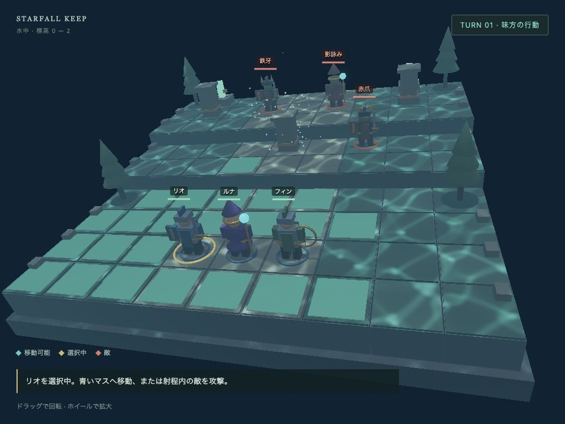

# fantasy — 翠の砦

[English](index.en.html) | 日本語



## 概要

高低差のある9×9マップで、剣士・魔術師・弓使いの3人を動かして敵3体を倒すターン制ゲームです。PBR（物理ベースレンダリング）のシーンに、動くNode、クリック選択、DOMの操作パネル、GPU粒子、勝敗と再開始を足す小さな統合例です。

外部モデルや音声ファイルは不要です。形状はPrimitiveで生成し、手足と装備をNodeの親子構造で接続します。戦闘ルールはGPUとDOMから独立しており、マスの経路と表示アニメーションを段階的に追えます。

戦場は水に沈んだ砦です。地形・装飾・部隊へコアのコースティクスを適用し、青緑の照明、距離フォグ、上へ漂う粒子で水中を表現します。「水中のコースティクス」を切り替えると、地面を流れる集光を比較できます。OFFでも水中の色とフォグは残ります。

## 実行と操作

WebGPU対応ブラウザで[fantasy.html](fantasy.html)を開きます。リポジトリ全体をHTTPで配信し、localhostまたはHTTPSを使ってください。初回はPBRとGPU粒子を準備します。

1. 3Dの味方、または部隊一覧から操作するユニットを選びます。
2. 青いマスをクリックして移動します。
3. 射程内の敵をクリックして攻撃します。
4. 他の味方を操作し、最後に「味方ターンを終了」で敵の行動へ進みます。

各ユニットは移動1回・攻撃1回です。攻撃だけの行動も可能です。移動は攻撃前に行い、攻撃後は「待機」で行動を終了します。「待機」で個別に行動を終了します。敵は移動して射程に入り、攻撃可能な味方のうちHPが低い相手を狙います。

移動は上下左右、段差は1段までです。上りは移動力2、平地・下りは1を消費します。生存ユニットと障害物は通り抜けられません。高所からの攻撃はダメージ+3。射程はマス距離で、遠隔攻撃は障害物を越えます。命中は確定です。

全敵撃破で勝利、味方全滅で敗北。「最初から」「もう一度戦う」で再開始します。「マスをボタンで操作」を開くと、TabとEnterでも同じ選択・移動・攻撃を行えます。

ドラッグで視点を回し、ホイールで拡大します。初期視点は斜めから見下ろす透視投影です。大きい画面ではCanvasを960×720とし、狭い画面では幅に合わせ、操作パネルを下へ配置します。

## 使用しているwebgの機能

- `WebgSceneApp`: SceneDefinitionと同じ構造のmanifest objectから、PBRとGPU粒子をまとめて起動します。ゲームの更新は`onUpdate({ deltaSec })`へ置きます。
- `Shape`・`Primitive`・`Node`: 胴体、関節、装備を作ります。親の移動に子部品が追従し、四肢の差分回転で歩行を表します。
- PBR材質・環境光・影・Bloom・Fog: 草と石は粗く、鎧と金の装備は金属度を高くします。環境光は`blue-sky`、鉛直方向光は淡い青色です。
- `WaterBody`・`PbrRenderer.setWater()`: 水面の波から照度を作り、地形と動く部隊の直接拡散光へ投影します。水面の屈折表示はOFFとし、操作するマスを読みやすく保ちます。
- `Space.raycast()`: 画面座標をReverse-Z対応のレイへ変え、地形またはキャラクターを選択します。判定はAABBです。
- `ComputeParticleEmitter`: 足元、魔法、火花、漂う光を別装置で発生させます。標準入口が更新とPBRへの合成を行います。

`physics:false`にして、経路探索と高低差を作品側のマス規則で扱います。剛体物理、外部モデルのスキニング、clip再生は使いません。

## 確認ポイント

- リオを選び、補助盤の「列4 行5 高さ1」へ移動すると、上りのコストを含む4の移動力を使い、標高0から1へ歩きます。
- 移動中は手足と上下動、到着した足元の粒子を確認します。行動中のボタンは無効になり、表示が終わってからマスを確定します。
- フィンは射程4、ルナは射程3です。射程外のクリックではHPを変えず、説明を表示します。
- 攻撃の軌跡、着弾粒子、被弾の揺れ、HP減少、戦闘不能の表示を確認します。
- 敵ターンの高所攻撃にはログで「高所 +3」が付きます。次の味方ターンには行動権が戻ります。
- 再開始でHP、配置、ターン、ログ、粒子が戻ります。GPU資源は再利用します。
- カメラ回転と画面の幅変更後も、頭上ラベルとクリック位置が3D表示に合うことを確認します。
- 集光が地形とユニットの移動に追従し、ON/OFF後も移動・攻撃・ターン進行を続けられることを確認します。

## コードを読む順序

1. **`main.js`の`start()`**: 一つの入口からシーンを起動し、動くNodeと入力を追加してから`start()`します。描画ループや粒子のstepを別に作りません。
2. **`scene.js`の`createManifest()`**: 配置・共通材質・PBR・粒子を初期データとして読みます。地形のマスと描画高度は`rules.mjs`から生成します。
3. **`visuals.js`の`part()`と`character()`**: 直接Shapeへ指定するRGBAとPBR材質、Nodeの親子関係、手動Shapeの所有者を確認します。
4. **`main.js`の`choose()`→`move()`→`updateMotion()`**: マスを選び、表示を待ち、論理座標を確定する順序を追います。`rules.mjs`の`paths()`は上りのコストを含む経路探索です。
5. **`main.js`の`makePointerRay()`・`pickTile()`・`updateLabels()`**: 3Dの選択とDOMの表示へ同じカメラを使う箇所を読みます。
6. **`FantasyApp.js`と終了処理**: CSS寸法、Canvas、PBRの描画先を同期し、Observer・手動Shape・標準入口をそれぞれ解放します。

`main.js`の`reset()`はこのゲームの再開始で、コアの`WebgSceneApp.reset()`とは別の関数です。HPや行動権の復元はゲーム側の責任です。

## 水中の照明を接続する

`main.js`の`connectWater()`で、全体を覆う幅・奥行き18m、平均水面高さ6mの`WaterBody`を作ります。地形と部隊の親Nodeを`addReceiver()`へ渡すと、手足・装備を含む子Shapeへ登録が引き継がれます。移動マーカーと選択リングは対象から外します。描画ループの`update()`では`setTime()`で秒単位の時刻だけを更新します。

```js
await sceneApp.renderer.setWater(water, {
  causticsEnabled: true,
  surfaceEnabled: false,
  quality: "high"
});
```

ON/OFF時は`sceneApp.stop()`で新しいframeを止め、`setWater()`の準備を待ってから再開します。OFFで専用GPU資源を解放し、再ONでも戦闘状態と登録済みNodeを引き継ぎます。再開始では水域を再利用します。

これは水中の雰囲気を作る照明演出です。RGB吸収の設定は集光の減衰に使い、カメラまでの濁りは標準Fogで近似します。水中カメラの屈折・全反射・水面の裏側は描画しません。任意物体への集光は水平照度画像の投影近似で、影とPBRの鏡面反射は標準パイプラインが処理します。詳細は[waterの使い方](../water/index.html)を参照してください。

## 一つずつ変更して学ぶ

- **鎧の粗さを変える**: `visuals.js`の`palette.steel.roughness`を0.28から0.65へ変えます。カメラを回してハイライトの広がりを比較します。地形の共通材質は`scene.js`側です。
- **移動力を変える**: `rules.mjs`のリオの`move`を4から3へ変えます。最初の「列4 行5」へ届かなくなることを確認します。経路と青い表示は同じ結果から更新されます。
- **歩行をゆっくりにする**: `main.js`の`move()`にある区間の`duration`を増やします。HPや射程を変えず、移動中の入力停止と到着時のマス確定を確認します。
- **粒子を変える**: `scene.js`の`steps.appearance.colors`の二つのRGB色を変えます。`main.js`の発生位置やゲームの経路はそのまま使えます。

一つ変更するごとに上の確認ポイントを試します。材質、ルール、表示速度、効果を同時に変えない方が、結果の原因を判断しやすくなります。

## 文書と自動確認

[fantasy_design.md](fantasy_design.md)はゲームの設計と機能の範囲です。`camera_reference.json`には初期視点の参照値を保存しています。[bookの「PBRシーンから小さなゲームへ」](../../book/examples/fantasy_guide.html)と併せると、単機能の例からこの構成へ進む境界を確認できます。

リポジトリのルートから次を実行すると、GPUを使わず地形・経路・占有・射程・敵の計画・勝敗を確認できます。描画と操作はブラウザで別に確認します。

```sh
node --test samples/fantasy/rules.test.mjs
```
