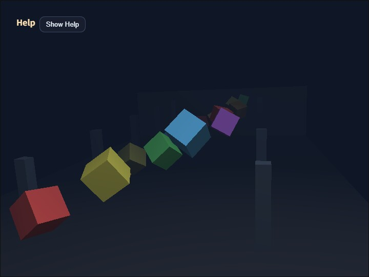

# fog_cube

[English](README.en.md) | 日本語

## 概要
- `WebgApp`のfog機能を一通り確認するサンプルです。
- mode, near, far, density, fog color をキーボードまたは CommandPalette で切り替え、複数の距離に並んだ cube 群にどう効くかを確認できます。
- 複数距離に並んだ cube 群と床、壁を使い、fog の見え方だけを集中的に確認できる構成です。

## 実行方法
- 実行ファイルは [./fog_cube.html](./fog_cube.html) です
- WebGPU に対応したブラウザで開き、必要に応じて help panel や HUD と合わせて確認してください
- `/` または canvas のダブルタップで CommandPalette を開き、fog 設定を変更できます

## 使用している webg 機能
- WebgApp: fog 設定、HUD、入力、camera rig をまとめて初期化
- EyeRig(type="orbit"): ドラッグ、矢印キー、ホイールで視点を調整
- Primitive: floor、wall、cube、pillar の形状を ModelAsset として生成
- Shape.setMaterial("smooth-shader", ...): 各 object に fog が掛かる標準材質を適用
- Shape.setWireframe(): 一部 cube または scene 全体を wireframe 表示に切り替え、wireframe でも fog が効くことを確認
- Message: 操作ガイドと fog 状態の表示
- CommandPalette: fog mode、wireframe、near、far、density、color preset、pause、reset の操作

## 確認ポイント
- 1 / 2 / 3 で off / linear / exp を切り替えたとき、遠距離の cube と床がどのように消えていくかを比較します。
- Q / W で near、A / S で far を変え、linear fog の開始位置と終端位置が想定どおり動くかを確認します。
- Z / X で density を変え、exp fog の減衰の強さが滑らかに変化するかを確認します。
- C で fog color を切り替えたとき、背景色と fog 色が揃って scene 全体の空気感が変わることを確認します。暗い青系だけでなく、白い霧のような preset も含まれます。
- 4 で一部の cube だけを wireframe 表示にし、5 で scene 全体を wireframe 表示にします。wireframe の線も通常描画と同じ fog 設定で遠景に溶け込むことを確認します。
- orbit camera を動かしても、object 単位ではなく view 距離ベースで fog が掛かり続けることを確認します。

## 操作方法
- ドラッグ / 矢印キー: オービットカメラ回転
- ホイール / [ / ]: ズーム
- 1: fog off
- 2: linear fog
- 3: exp fog
- 0: solid 表示へ戻す
- 4: 一部 cube の wireframe 表示を切り替え
- 5: scene 全体の wireframe 表示を切り替え
- Q / W: fog near を減少 / 増加
- A / S: fog far を減少 / 増加
- Z / X: fog density を減少 / 増加
- C: fog color preset を切り替え
- Space: object の回転と上下動を一時停止
- R: camera と fog を初期値へ戻す
- `/` または canvas ダブルタップ: CommandPalette を開く
