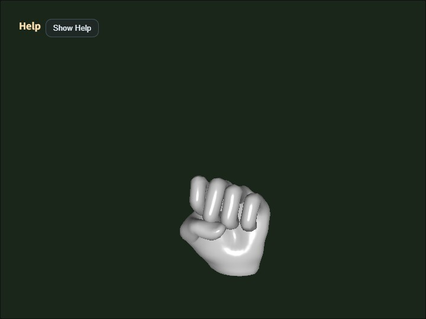

# gltf_loader

English | [日本語](README.md)

## Overview
- This sample loads the glTF / GLB file specified in `main.js`, normalizes it into `ModelAsset`, and then displays it
- It calls the glTF facade from `WebgApp.loadModel()`, so you can inspect the flow in which `ModelAsset` data and runtime objects are assembled internally
- The loaded `ModelAsset` can be downloaded as a JSON file with the `D` key
- For glTF files that have a static parent-node transform, the importer side bakes parent rotation and parent scale for skinned meshes so that runtime complexity is not increased
- When exporting glTF / GLB from Blender, the loader assumes files are exported in `Y-up`
- The loader's model-origin policy uses the skeleton root as the origin for skinned models and the mesh node as the origin for non-skinned models

## How to Run
- Open [./gltf_loader.html](./gltf_loader.html)
- Use a browser with WebGPU support, and check the Help Panel and CommandPalette together with the sample when needed

## webg Features Used
- `WebgApp`: standard initialization, render loop, and Help Panel display
- `CommandPalette`: groups animation control, wireframe, screenshot, JSON export, and camera reset
- `WebgApp.loadModel`: high-level entry point for the glTF facade
- `ModelLoader`: normalizes glTF / GLB into `ModelAsset` and bundles build / instantiate
- `ModelAsset`: holds validated data and supports JSON download
- `ModelAsset.getClipNames`: inspects the clip list before build
- `ModelBuilder`: builds shapes, skeletons, and animations from `ModelAsset`
- `ModelBuilder.animationMap`: accesses runtime animations from clip IDs
- `build()` result helpers: `instantiate() / createNodeTree() / bindAnimationBindings() / getAnimation() / getAnimationNames() / restartAnimation() / pauseAnimation() / resumeAnimation() / startAllAnimations() / playAllAnimations() / setAnimationsPaused()`
- `EyeRig(type="orbit")`: orbit viewpoint based on the world bounding box

## Processing Flow
- The sample calls `WebgApp.loadModel(GLTF_FILE, { format: "gltf" ... })` and enters the glTF facade from the format dispatch in the loader
- `ModelLoader` reads the file and hands parsing and normalization to `GltfShape`
- `GltfShape` aligns materials, meshes, skeletons, animations, and nodes into `ModelAsset` format
- At that stage, glTF files with static parent-node transforms run `buildStaticBakePlans()`, and parent rotation / parent scale are baked into meshes, skeletons, and animations for skinned meshes
- For non-skinned meshes, the path that handles static uniform scale as geometry bake remains available, while runtime nodes can also handle uniform scale
- `ModelBuilder` then constructs the runtime `Shape / Skeleton / Animation / Node` objects from `ModelAsset`

## How to Read the Downloaded JSON
- `meta.source` is expected to be `glTF`, and `meta.upAxis` is expected to be `Y`
- `meshes[].meta.staticBake` appears only on meshes to which the importer applied static bake
- `meshes[].meta.bakedNodeIndex` is the index that shows which glTF node transform was baked into the geometry
- `skeletons[].meta.staticBake` is recorded when a parent transform bake was inserted on the root-joint side of a skinned mesh
- `nodes[].matrix` is the structural transform left for runtime use, and becomes identity on nodes whose skinning bake has already been applied
- Looking at `nodes[].animationBindings` and `animations[].targetSkeleton` lets you follow which clip is connected to which skeleton
- `gltfNodeIndex` and `gltfSkinIndex` let you trace the relationship between JSON-side nodes and the original glTF nodes / skins afterward

## Checkpoints
- Confirm that the file specified by `GLTF_FILE` is loaded and that shapes, skeletons, and animations are built correctly
- Confirm that with a single facade call, glTF node restoration and animation binding can use the same shared helpers as other formats
- Even for glTF containing skinned meshes, confirm that static parent rotation and uniform scale are baked on the importer side so that static meshes and skinned meshes do not end up with drastically different orientation
- Confirm that the `ModelAsset` JSON saved with the `D` key keeps `staticBake` metadata so you can later inspect which nodes / skeletons were baked
- If the raw glTF animation samplers contain `CUBICSPLINE`, confirm that they are converted to `LINEAR` by removing intermediate values and that the Interpolation Notice and Help Panel show information equivalent to `animationInterpolation=LINEAR converted=CUBICSPLINE->LINEAR:...`
- Even when loading a large glTF / GLB, confirm that the Load Progress panel shows `stage=...` during startup so you can at least see how far the load process has progressed
- For Rigify-style models, confirm that in addition to `required=...`, the fields `helperWeighted=...`, `helperAncestor=...`, and `helperPruned=...` let you judge whether helper bones are actually used by weights, kept only to preserve hierarchy, or already baked away and removable by the importer
- Confirm that the Help Panel shows `file / model / orbit / target / anim / clip0 / interpolation / wireframe` state so the necessary viewer state can be followed on screen
- Confirm that the first clip can be restarted by name with `restartAnimation(clipId)` using the `1` key
- Confirm that `2 / 3` can pause and resume the first clip individually with `pauseAnimation(clipId)` / `resumeAnimation(clipId)`
- Confirm that the camera distance is set automatically from the world bounding box that includes parent transforms on glTF nodes, so the entire model is visible in the initial framing
- Confirm that the JSON exported with the `D` key can be passed to `json_loader` and displayed again
- Confirm that `Shift + Arrow` and `Shift + Drag` move the camera target in parallel so fine details can be brought to the center
- Confirm that `W` toggles wireframe, `S` saves a screenshot, and `R` returns to the initial framing
- Confirm that the CommandPalette can run animation replay / pause / resume, wireframe, screenshot, JSON export, and camera reset
- Confirm that the Help Panel is used for current values and operation hints, while the CommandPalette is used for changing settings and running commands

## Reading Points for AI / Users
- If "the display looks correct but you cannot tell where scale was applied", inspect `meshes[].meta.staticBake` and `nodes[].matrix` first
- If "animations exist but do not play", inspect the relationship between `animations[].targetSkeleton` and `nodes[].animationBindings`
- If "a clip does not play", compare the Help Panel `Anim / Clip0` display with the bindings in the JSON
- If "the orientation of a skinned mesh with a parent node looks suspicious", check whether `skeletons[].meta.staticBake` is present and whether the asset contains scale animation or non-uniform scale

## Controls
- Drag / arrow keys: orbit camera rotation
- `Shift + Drag / arrow keys`: pan the camera target
- Mouse wheel / `[ / ]`: zoom
- `Space`: pause animation
- `1`: replay the first clip
- `2`: pause the first clip
- `3`: resume the first clip
- `W`: toggle wireframe
- `S`: save a screenshot
- `D`: download the `ModelAsset` JSON
- `R`: return the camera to the initial position based on the bounding box
- `/` or double tap the canvas: open the CommandPalette
