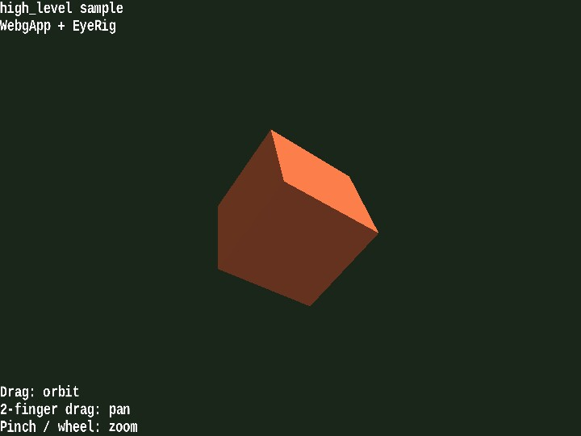

# high_level

[English](README.en.md) | 日本語

## 概要
- README.md の「標準の使い方」にある WebgApp 例を、すぐ実行して確認できるサンプルとして切り出したものです
- WebgApp を入口にして、Screen、shader、Space、camera rig、InputController、Message をまとめて初期化します
- README の最小例をそのまま確認しやすいように、camera 操作用として EyeRig(type="orbit") を加えています
- object は毎 frame 自動回転しつつ、マウスドラッグ / ホイール / arrow key / [ ] と、タッチの 1本指ドラッグ / 2本指ドラッグ / pinch で camera を動かせるため、WebgApp で組んだ最小 3D app の感触をすぐ確認できます
- S キーで WebgApp.takeScreenshot() を呼び、high_level_YYYYMMDD_HHMMSS.png 形式で canvas を保存できます

## 実行方法
- 実行ファイルは [./high_level.html](./high_level.html) です
- WebGPU に対応したブラウザで開き、必要に応じて help panel や HUD と合わせて確認してください

## 使用している webg 機能
- WebgApp: Screen / Shader / Space / Camera / Input / Message をまとめて初期化する
- WebgApp.takeScreenshot: Screen を直接触らずにスクリーンショット保存を予約する
- EyeRig: orbit camera のマウス / タッチ / キーボード操作を追加する
- Shape: primitive を GPU buffer と材質へまとめる
- Primitive: 立方体 mesh を作る
- Message: guide lines と status lines を canvas HUD へ出す

## 確認ポイント
- 起動直後に青い立方体が中央へ表示され、左上の status と左下の guide が重なることを確認します
- 立方体が自動回転し、WebgApp.start() だけで更新と描画が回ることを確認します
- ドラッグとホイールで orbit camera が動き、タッチでは 1本指ドラッグで回転、2本指ドラッグで平行移動、pinch で zoom でき、arrow key と [ ] でも同じ camera が動くことを確認します

## 操作方法
- ドラッグ: orbit camera
- 2本指ドラッグ: camera を平行移動
- pinch / ホイール: zoom
- arrow keys: orbit camera
- [ / ]: zoom
- S: screenshot 保存
