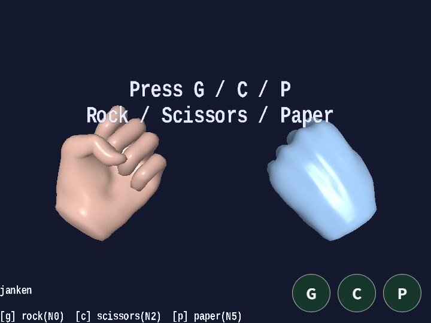

# janken

[English](README.en.md) | 日本語

## 概要
- samples/gltf_loader/hand.glb の手モデルと AnimationState を使って、ジャンケンを行うサンプルです。
- 手を 2 つ同時に表示し、左側は user、右側は app が担当します。
- user は G / C / P で手を決め、app 側は同じ frame で乱数から手を決めます。
- 画面下にはタッチボタンも表示し、PC でも G / C / P を直接押して操作できます。
- hand.glb は 1 回だけ build し、その runtime から player / cpu の 2 hand を instantiate() しているため、geometry / GPU buffer は共有しつつ animation runtime は別々に進みます。
- 各 hand は独立した Action と AnimationState を持ち、同じ asset を使っても別々に animation を再生できます。
- 操作ガイドと現在状態は app.message.setLines() でそろえ、勝敗だけを 2 倍スケールの短い Message で中央表示します。
- 2 つの hand は少し引いた距離からやや見上げ気味に見えるようにし、左右に約 30 度ロールさせています。
- ジャンケンの手遷移は entryDurationMs = 250 にそろえ、0.25 秒程度で次の手へ移る設定です。

## 実行方法
- 実行ファイルは [./janken.html](./janken.html) です
- WebGPU に対応したブラウザで開き、必要に応じて help panel や HUD と合わせて確認してください

## 使用している webg 機能
- WebgApp: Screen / Shader / Space / Input / Message をまとめて初期化し、app.message.setLines() と loadModel(..., { format: "gltf", instantiate: false }) で shared runtime を 1 回 build したあと、runtime.instantiate() で 2 hand を起こす
- Action: hand の key 区間を N0 / N2 / N5 の action として再生する
- Message: 勝敗結果の短い ASCII title を大きく中央表示する

## 確認ポイント
- G は hand の N0=12-13, C は N2=4-5, P は N5=10-11 に対応する pose になっていることを確認します。
- 同じ手を連続で入力しても self-transition により animation が再始動することを確認します。
- guide は画面下、status は画面上へ分かれ、勝敗だけが中央の大きな Message で表示されることを確認します。

## 操作方法
- G: グーを出す
- C: チョキを出す
- P: パーを出す
- Space: round と表示を初期状態へ戻す
- タッチボタン: G / C / P を PC と mobile の両方で表示し、キーボード と同じ key 名で扱う

補足
- このサンプルでは hand asset の pose 対応を次のように使います
  - グー: hand の N0=12-13
  - チョキ: hand の N2=4-5
  - パー: hand の N5=10-11
- AnimationState は再生品質自体を変えるものではなく、どの hand action を始めるかを整理するために使っています
- janken では入力イベントごとに AnimationState.setState(..., force: true) を呼び、同じ手でも action を再始動できる構成にしています
- 2 つの hand は runtime.instantiate() で別々に生成しているため、同じ mesh resource を共有していても Skeleton と Animation の runtime 状態は別です
- `hand.glb`では、GはN0の12-13、CはN2の4-5、PはN5の10-11を使います
