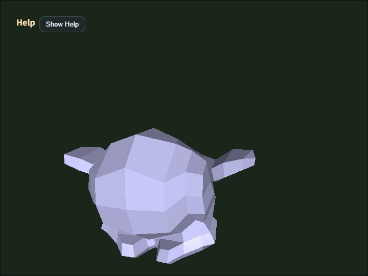

# json_loader

[English](README.en.md) | 日本語

## 概要
- main.js 内で指定した ModelAsset JSON ファイルを読み込み、そのまま表示するサンプルです。
- gltf_loader や collada_loader が D キーで出力した JSON を、ファイル名を合わせてこのサンプルで再表示できます。
- WebgApp.loadModel() から JSON facade を呼び、形式差を意識せず ModelAsset と runtime を得るサンプルです。
- 同梱の`modelasset.json`には、同じ元clipを複製した`ArmatureAction_skeleton_0`と`ArmatureAction_skeleton_0_copy`の2 clipを収録しています。

## 実行方法
- 実行ファイルは [./json_loader.html](./json_loader.html) です
- WebGPU に対応したブラウザで開き、必要に応じて Help Panel と CommandPalette を合わせて確認してください

## 使用している webg 機能
- WebgApp: 標準初期化、描画ループ、Help Panel 表示
- CommandPalette: clip 操作、wireframe、screenshot、JSON 出力、camera reset をまとめる操作パレット
- WebgApp.loadModel: JSON facade の高レベル入口
- ModelLoader: JSON load / validate / build / instantiate をまとめる
- ModelAsset.load: JSON ファイルをロード
- ModelAsset.getClipNames: JSON に含まれる clip 一覧確認
- ModelAsset.build: JSON から Shape / Skeleton / Animation を構築
- ModelBuilder.animationMap: clip id から runtime Animation を引く
- build() 結果 helper: instantiate() / createNodeTree() / bindAnimationBindings() / getAnimation() / getAnimationNames() / startAllAnimations() / playAllAnimations() / setAnimationsPaused()
- EyeRig(type="orbit"): バウンディングボックス基準のオービット視点

## 確認ポイント
- MODEL_ASSET_FILE で指定した JSON が validator を通過し、そのまま描画できることを確認します
- Help Panel に file / model / orbit / target / anim / clip / wireframe 状態が表示され、viewer として必要な状態を画面上で追えることを確認します
- サンプル内では facade の戻り値 runtime を使って node 復元と animation binding を共通化し、animationMap 直参照ではなく getAnimation() / getAnimationNames() を使って接続確認できることを確認します
- 4 / 5 キーで対象 clip を切り替え、1 / 2 / 3 が現在選択中 clip に対して動作することを確認します
- 4 / 5 キーで ArmatureAction_skeleton_0 と ArmatureAction_skeleton_0_copy を切り替えられることを確認します
- 1 キーで選択中 clip を restartAnimation(clipId) により名前指定で再始動できることを確認します
- 2 / 3 キーで選択中 clip を pauseAnimation(clipId) / resumeAnimation(clipId) により個別停止・再開できることを確認します
- カメラ距離がバウンディングボックスのサイズに応じて自動設定され、モデル全体を見失わないことを確認します
- Shift + Arrow と Shift + Drag で camera target を平行移動でき、細部を中央へ寄せて確認できることを確認します
- W で wireframe、S で screenshot、R で初期 framing へ戻ることを確認します
- CommandPalette から clip の replay / pause / resume / selection、wireframe、screenshot、JSON 出力、camera reset を実行できることを確認します
- Help Panel は現在値と操作説明、CommandPalette は設定変更と実行操作という役割で読めることを確認します

## 操作方法
- ドラッグ / 矢印キー: オービットカメラ回転
- Shift + ドラッグ / 矢印キー: カメラ target の平行移動
- ホイール / [ / ]: ズーム
- Space: アニメーション一時停止
- 1: 選択中 clip を再生し直す
- 2: 選択中 clip を一時停止
- 3: 選択中 clip を再開
- 4: 前の clip を選択
- 5: 次の clip を選択
- W: wireframe 切り替え
- S: screenshot 保存
- D: 現在の JSON を再ダウンロード
- R: カメラをバウンディングボックス基準の初期位置へ戻す
- / または canvas ダブルタップ: CommandPalette を開く
