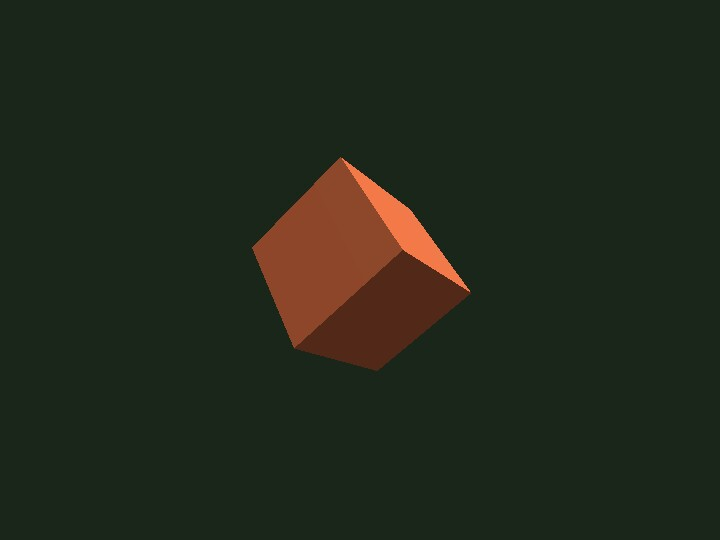

# low_level

English | [日本語](README.md)

## Overview
- This sample extracts the low-level example from the "standard usage" section of `README.md` so it can be run directly without modification
- It connects `Screen`, `SmoothShader`, `Space`, `Shape`, and `Primitive` directly and builds a minimal 3D display without using `WebgApp`
- At startup it initializes WebGPU and the shader, sets the projection matrix, and then places only a single cube in the scene
- The object rotates a little every frame, so the directions of the edges and faces keep changing and you can directly inspect the sense of volume and how the light hits it
- The canvas size and projection are updated on `resize` and `orientationchange`, so the aspect ratio stays stable on both desktop and mobile devices

## How to Run
- Open [./low_level.html](./low_level.html)
- Use a browser with WebGPU support, and check the help panel and HUD together with the sample when needed

## webg Features Used
- `Screen`: handles canvas setup and WebGPU initialization
- `SmoothShader`: the standard shader used for this minimal solid rendering
- `Matrix`: creates the projection matrix
- `Space`: holds the scene graph and draw order
- `Shape`: bundles primitives into GPU buffers and materials
- `Primitive`: creates the cube mesh

## Checkpoints
- Right after startup, confirm that a blue cube appears at the center and rotates automatically over the dark background
- Confirm that the cube rotates little by little around both Y and X, changing edge directions and lighting
- Confirm that even after browser-window resize or smartphone rotation, the cube does not look squashed and the aspect ratio is preserved
- Confirm that even without `WebgApp`, the minimal display still works in the order `Screen -> shader -> projection -> Space -> Shape -> draw`

## Controls
- This sample plays automatically and has no interactive controls
