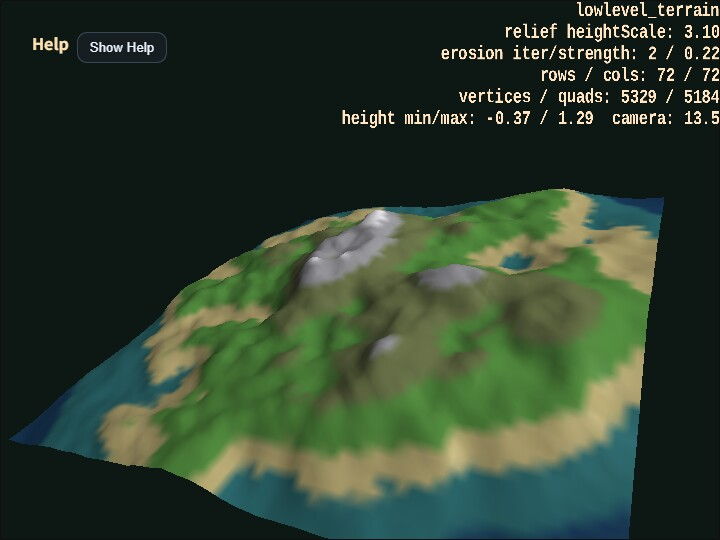

# lowlevel_terrain

English | [日本語](README.md)

## Overview
- This sample uses `WebgApp` for the camera and HUD while building the terrain mesh itself only with the low-level `Shape` API
- It determines heights with value noise and `fbm`, lays quads over a shared-vertex grid with `addPlane()`, and constructs continuous terrain as a single mesh
- It also generates a height-band texture from the same height field as the mesh, providing shoreline, grassland, rock, and snowline-like color transitions as one procedural texture
- Steep steps are softened with simple erosion-like smoothing, slightly collapsing sharp cliffs into more natural ridges and slopes
- Because a falloff lowers the outer area and raises the center, an island-like silhouette appears clearly
- The sample is arranged so that inspecting normals up close with orbit and zoom, then inspecting the outline from far away, makes the intention of the low-level terrain generation easier to understand
- `Q / E` changes camera distance and `- / =` changes terrain relief on the spot, making it easy to compare how appearance changes while the topology stays the same

## How to Run
- Open [./lowlevel_terrain.html](./lowlevel_terrain.html)
- Use a browser with WebGPU support, and check the help panel and HUD together with the sample when needed

## webg Features Used
- `WebgApp`: initializes startup, camera, HUD, input, and fog
- `EyeRig`: orbit camera and zoom
- `Shape.addVertexUV()`: places grid vertices
- `Shape.addPlane()`: adds quads as pairs of triangles

## Checkpoints
- Right after startup, confirm that an island-like terrain appears and can be inspected both from above and from an angled viewpoint with the orbit camera
- Confirm that rows / cols, vertex count, quad count, and the minimum and maximum height values are displayed at the upper right
- Confirm that surface colors change by height band, making the terrain easier to read from lowlands to highlands
- Because normals are generated from shared vertices, confirm that the terrain surface looks continuous and smooth
- Confirm that the erosion-like smoothing softens steep noise-only steps slightly compared with raw terrain noise
- Confirm that zooming in reveals mountain-surface slopes, while zooming out reveals the overall silhouette and the effect of the falloff
- Confirm that `heightScale` and the terrain relief change together at the upper right when using `- / =`

## Controls
- Drag: orbit camera
- Two-finger drag: pan the camera
- Pinch / mouse wheel: zoom
- Arrow keys: orbit camera
- `[ / ]`: zoom
- `Q / E`: move the camera closer / farther
- `- / =`: decrease / increase terrain relief
- `R`: return to the default view
