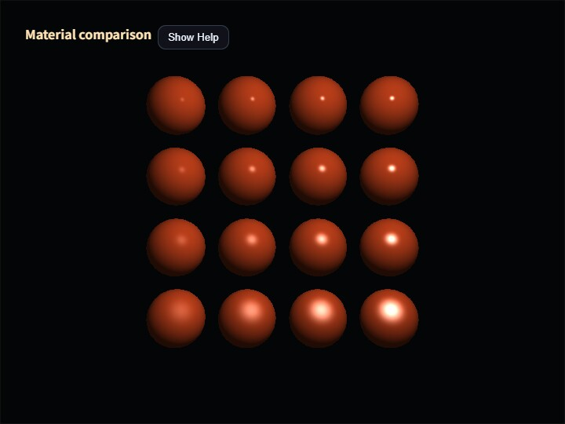

# materials

English | [日本語](README.md)

## Overview

This sample renders the same sixteen icospheres with either the standard `SmoothShader` or Deferred Lighting. Both paths share the scene graph, camera, vertex normals, and light position, so the display isolates the difference between the Phong-style and GGX-style lighting models instead of mixing in geometry or viewpoint changes.

`SmoothShader` primarily uses `ambient`, `specular`, and `power`. Deferred Lighting evaluates the G-buffer values `specular`, `roughness`, `metallic`, and `emissive` with a GGX reflection model. Although both paths use the name `specular`, the standard path treats it as the additive intensity of a white highlight, while the deferred path uses it to scale the nonmetallic F0 range from zero to four percent. Equal numbers therefore do not describe equal reflectance.

## Reading the Display

The initial layout is a 4×4 comparison grid. `roughness / power` changes from top to bottom, and `specular / metallic` changes from left to right. The standard path ignores `roughness` and `metallic`; the deferred path ignores `power`. Changing a value used by only one path makes each parameter's responsibility visible.

Smooth ambient starts at 0.18, while the deferred linear diffuse-environment intensity starts at 0.035. They are stored separately because they have different meanings in the two lighting equations. The deferred comparison uses a linear clamp instead of Reinhard compression, followed by the exact sRGB display conversion, so the comparison does not mix a different tone curve into the lighting-model difference.

The icosphere uses subdivision level two, 162 shared vertices, and 320 triangles. Each normal is the normalized sphere position. Vertices duplicated at the UV seam copy the same authored normal, allowing the standard and G-buffer paths to consume the same smooth normal field.

## Controls

Open [materials.html](./materials.html) in a WebGPU-capable browser.

- `M`: switch between `SmoothShader` and Deferred Lighting
- `G`: switch between the 4×4 grid and uniform values on all spheres
- `R`: restore the defaults
- `/` or double-tap the canvas: open the Command Palette
- drag or use the arrow keys: orbit the camera

The Command Palette controls the renderer, layout, RGB color, renderer-specific ambient value, specular, emissive, roughness, metallic, and power. Grid mode preserves the four relative steps while applying the edited base value. Uniform mode applies the entered value directly to all sixteen spheres.

## Implementation Notes

The standard path performs forward rendering with `Space.draw(cameraFrame)`. The deferred path passes the same `cameraFrame` to `ComputeEffectPipeline.renderScene()` and `encode()`, ensuring that G-buffer generation and lighting use one camera snapshot. The final display color is copied to the canvas in `beginPresentPass()`, followed by `clearDepthBuffer()` to restore the depth-enabled pass used by the HUD.

Every material value is specified on the Shape even when one renderer does not read it. The sample does not infer missing values through fallback behavior. A fully metallic surface may be black without environment specular reflection, so the default grid uses metallic values 0.00, 0.25, 0.50, and 0.75. Uniform mode still allows an explicit value of 1.0 for inspection.
