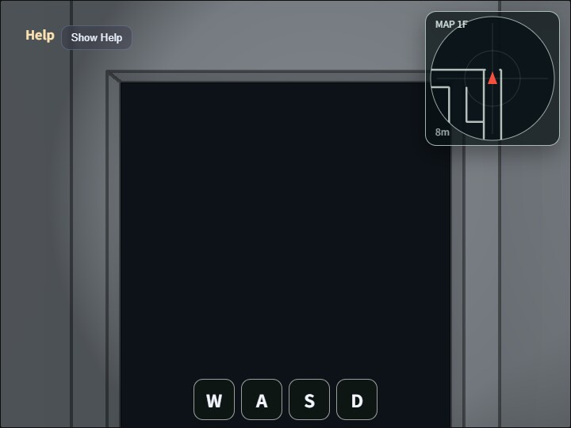

# maze

[English](README.en.md) | 日本語

`maze` は、first-person移動、衝突判定、spot light、Compute Effect、レーダー表示を備え、動的に生成した迷路を歩き回るウォークスルー用サンプルです。

`main.js`は固定seedの疑似乱数から15×15 cellのDFS迷路を生成し、`Primitive.cuboid()`で床、壁、天井、部屋入口のside jamb、上部lintelを組み立てます。固定のModelAssetは読み込まず、生成した形状を`WebgApp`で描画します。

迷路は1階建てです。通路グリッド幅は`2.5m`、壁厚と天井厚は`0.1m`、天井下面は床面から`3.0m`、歩行者のbaseは`y = 0.0`、`EyeRig.eyeHeight = 1.6m`です。壁厚を通路幅に含めるため、有効通路幅は概ね`2.4m`です。

床色は通常通路、部屋、開始エリア、ゴールエリアで分けています。迷路生成後には複数箇所へ `2 x 2` cell 以上の room を上書きし、room の内部壁を取り除いたうえで、幅 `2.0m`、高さ `2.4m` の入口を作ります。入口の上部 lintel は高さ `0.55m` とし、天井下面 `3.0m` との間へ `0.05m` の余白を残します。

レーダーは `walk_around` と同じ heading-up 方式で、現在位置近くの collision segment を右上の 2D canvas へ重ね表示します。door の上部 lintel はプレイヤー円柱の高さ範囲と重ならないため、衝突対象にもレーダー表示にも含まれません。door の左右 jamb は歩行者に対する衝突対象として残ります。

迷路生成、部屋、扉、衝突判定、レーダーの詳しい規則は[maze_spec.md](./maze_spec.md)に記載しています。

## 実行方法

- 実行ファイルは `./maze.html` です
- WebGPU 対応ブラウザで開きます
- PC ではドラッグとキーボード、スマートフォンではドラッグと画面下の `W` / `A` / `S` / `D` button を使います
- Canvas の double tap / double click、または `/` key で command palette を開きます

## 使用している webg 機能

- `WebgApp`: 初期化、描画ループ、HelpPanel、HUD、FrameTimer
- `Shape` / `Primitive.cuboid()`: 床、壁、天井、入口の side jamb と lintel を procedural に組み立てる
- `EyeRig`: `first-person` mode の移動、視線回転、run 操作を扱う
- `CommandPalette`: Compute Effect と spot light の設定を小画面を覆い続けない palette にまとめる
- `ComputeEffectPipeline`: SSAO、Shadow、SSR、Toon、DoF、Bloom、Edge を設定に応じて描画へ適用する
- `FullscreenPass`: compute effect の最終結果を canvas へコピーする
- `CollisionWorld` / `WalkCollisionBuilder`: procedural に生成した wall cuboid から衝突線分を抽出し、円柱プレイヤーの移動を解決する
- DOM `canvas`: 現在位置周辺の衝突線分を heading-up レーダーとして重ね表示する

## 操作方法

- 左右Drag: 進行方向と視線を左右へ回転する
- 上下Drag: 操作中だけ上または下を見る。Drag終了時に pitch は水平へ戻る
- `W` / `S`: 前進 / 後進
- `A` / `D`: 左旋回 / 右旋回
- `Shift`: 移動を速くする
- `5` / `6`: Toon の段階数を 2 から 8 の範囲で減らす / 増やす
- `0`: 初期視点へ戻す。位置は`[-2.5600, 0.0, 6.0572]`、視点高さは`1.60m`、方位角は`-29.91°`
- `K`: screenshot を保存する
- Canvas の double tap / double click、または `/`: command palette を開閉する
- Palette 1 page: SSAO、Shadow、SSR、Toon、DoF、Bloom、Edge、Ambient Only、Ambient Strength、Toon Levels、Edge Thickness、Edge Blend を設定する
- Palette 2 page: Spot FOV / Inner / Outer、視点 reset、screenshot を操作する

## 確認ポイント

- 起動直後と `0` による reset 後に、maze2と同じrow、colとcell内相対位置に対応する`[-2.5600, 0.0, 6.0572]`、方位角`-29.91°`のfirst-person視点へ戻ること
- 左右Dragで進行方向と視線が一緒に回転し、上下Dragでは操作中だけ上または下を見て、Drag終了時に水平へ戻ること
- `W` / `A` / `S` / `D` で、orbit ではなく first-person 視点の移動として操作できること
- 壁や room door の side jamb で移動が止まり、door 開口部だけを通過できること
- 右上の `MAP` で、視点前方が上向きになり、近くの壁や柱の衝突線分が白い線として表示されること
- room、start、goal、通常通路で floor color が異なること
- 固定 seed のため、再読み込み後も同じ迷路形状になること
- 初期状態では Edge が有効、Toon が無効で表示され、palette から各 effect を個別に切り替えられること
- HelpPanel と HUD に、現在位置、視線角度、room 数、GPU Compute / GPU Render / JS Load が出ること

## ファイル

- `maze.html`: 実行ページ
- `main.js`: 迷路生成、first-person 移動、Compute Effect、レーダーの実装
- `CollisionWorld.js`: XZ 平面の円柱プレイヤー用 collision world
- `WalkCollisionBuilder.js`: wall shape から collision segment を抽出する helper
- `maze_spec.md`: 迷路生成、部屋、扉、衝突判定、レーダーの詳細仕様
- `README.md`: 日本語の説明
- `README.en.md`: 英語の説明
