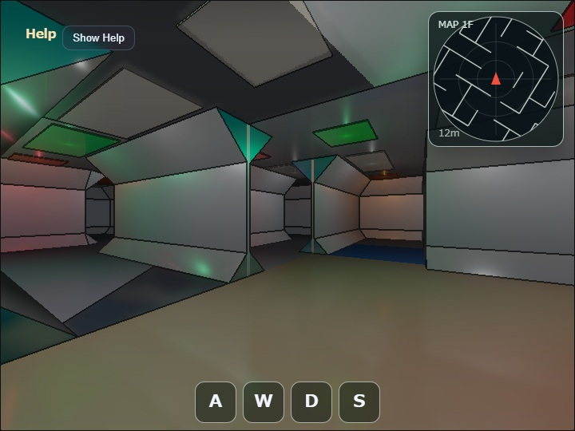

# maze2 (sci-fi tube edition)

[English](README.en.md) | 日本語

## 概要

`maze2` は、壁心間と天井高を4 mとし、壁上下の構造斜面で八角形断面を作るwalk-through mazeです。曲がり角では直交するrail終端辺をmiter bridgeで直接つなぎ、隙間を作らず開口側へ不要な面を張りません。分岐、部屋、扉は論理wall boundaryから生成し、同じboundaryを衝突判定とレーダーにも使用します。

描画は`ComputeEffectPipeline`を使用し、`WebgApp`が描画直前に確定した同一の`CameraFrame`をG-buffer、Deferred Shading、SSR、Bloom、geometry edgeで共有します。
各cellの天井には、通路方向へ長い薄型panelを中心高さ`y = 3.95m`で配置し、その下の`y = 3.70m`に通路照明用のpoint Local Lightを置きます。
point Local Lightは半径`7.2m`、強度`5.2`で全方向を照らし、下側の通路を照らすと同時に、光源から約`0.2375m`上にある天井灯下面へ強い直接反射を作ります。
構造天井の`roughness`は`0.55`とし、点光源による細長い鏡面反射を広げて弱めます。
Shadow Mapは無効なため、点光源と照明対象の間にある形状による遮蔽は計算しません。
天井灯全体の`emissive`は`0.10`へ抑え、`specular = 0.80`、`roughness = 0.10`の下面中央に生じる直接反射を主な高輝度成分とします。
照明色は白60%、緑・オレンジ・赤を各13.3%の固定比率で分散します。
camera近傍から最大64灯を評価します。
SSRは床、壁、斜面、天井の反射へ使用します。
Bloomは`threshold = 0.60`、`softKnee = 0.40`、`strength = 1.10`、`1/32 Weight = 0.80`とし、天井灯全面の自己発光ではなく、下面中央のHDR反射から広い光芒を作ります。
Shadow MapとSSAOの効果は無効にしています。

詳細な形状規則は[maze2_spec.md](./maze2_spec.md)に記載しています。

## 実行方法

- 実行ファイルは[./maze2.html](./maze2.html)です
- WebGPU対応browserで開きます
- PCではdragとkeyboard、coarse pointer端末では画面上のtouch操作を使います
- double tap、double click、または`/` keyでCommand Paletteを開きます

## 使用しているwebg機能

- `WebgApp`: 初期化、描画loop、CameraFrame、HUD、Help Panel、GPU計測をまとめる
- `EyeRig`: first-personの視線回転と移動基準を作る
- `Shape`: grouped meshとして床、壁、斜面、rail、天井、照明panelをGPU bufferへまとめる
- `ComputeEffectPipeline`: G-buffer、Deferred Lighting、SSR、Bloom、geometry edgeを同じCameraFrameで実行する
- `FullscreenPass`: pipelineの最終表示textureをcanvasへ転送する
- `CommandPalette`: SSR intensityとgeometry edgeなど、低頻度の設定を変更する
- `Diagnostics`: triangle数、collision segment数、active light数、GPU timingをHUDとreportへ出す
- sample側`CollisionWorld`: 論理wall segmentと円柱playerの衝突をXZ平面で解決する

## 実装の流れ

`main.js`は固定seedから15×15 cellの迷路を作り、roomとdoorを上書きして、通行可能な論理wall boundaryを確定します。次に同じboundaryから床、斜面、壁、rail、天井のgrouped meshと衝突線分を作ります。レーダーもこの衝突線分を読むため、画面上の壁、移動を止める壁、レーダー上の線が別々の規則から生成されません。

毎frameの更新では、入力からfirst-personの移動量を求め、`CollisionWorld`でplayer円柱をwall segmentの外へ押し戻します。cameraが一定距離以上移動したときだけ近傍lightを選び直し、最大64灯をDeferred Lightingへ渡します。HUDとレーダーは衝突解決後の位置を使って更新します。

描画では、`onBeforeDraw`が受け取る`cameraFrame`で`ComputeEffectPipeline.renderScene()`を実行し、`onAfterDraw3d`で同じframeを`encode()`へ渡します。完成textureは`beginPresentPass()`と`FullscreenPass`でcanvasへ転送し、`clearDepthBuffer()`でHUD用の深度付きpassへ戻します。Shadow MapとSSAOは無効で、SSR、Bloom、geometry edgeだけを用途に応じて使用します。

## 操作方法

- 左右 drag: 進行方向と視線を回転
- 上下 drag: 一時的に上下を見る
- `W` / `S`: 前進 / 後進
- `A` / `←`: 右旋回、`D` / `→`: 左旋回
- `Shift`: 走る
- `5` / `6`: SSR intensity を減らす / 増やす
- `0`: 初期視点へ戻る。位置は`[-4.0960, 0.0, 9.6915]`、視点高さは`1.60m`、方位角は`-29.91°`
- `K`: screenshot
- double tap / double click または `/`: command palette
- CommandPaletteの `Edge`: geometry edgeのON/OFF

## 確認ポイント

- 直線通路が床、下部斜面、垂直壁、上部斜面、天井による八角形断面に見える
- 扉、曲がり角、分岐、部屋を通行でき、壁抜けがない
- 各cellの天井灯下面中央に強い反射が生じ、その反射を中心に広いBloomが見える
- SSR の ON / OFF 差が床と金属レールで確認できる
- 3方向以上の分岐床が青緑色になり、通常通路と区別できる
- HUD に triangle 数、collision segment 数、active light 数、GPU timing が表示される
- radarが半径12 mの範囲を表示する

## ファイル

- `maze2.html`: 実行ページ
- `main.js`: 迷路生成、grouped mesh、first-person 操作、deferred lighting、SSR、geometry edge
- `CollisionWorld.js`: 論理 wall segment に対する円柱 player collision
- `maze2_spec.md`: 形状、迷路生成、衝突判定、照明の詳細仕様
- `maze2.txt`: サンプル一覧向けの概要説明
