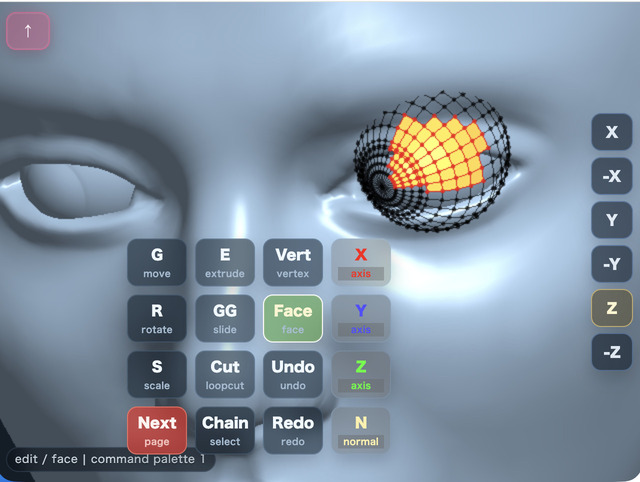
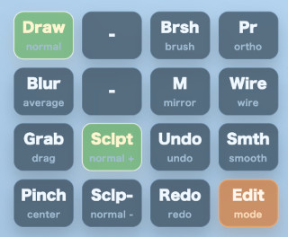

# mmodeler User Guide

English | [日本語](README.md)

## Overview
mmodeler is a Blender-inspired 3D modeling tool optimized for touch operation on smartphones and tablets. Built with WebGPU and JavaScript, it allows you to control the camera, edit meshes, add primitives, save/load files, and perform organic shaping using a dedicated Sculpt Mode—all through intuitive gesture-based controls.

## How to Run
- Open [./mmodeler.html](./mmodeler.html) in a browser with WebGPU support.

mmodeler does not depend on external libraries or servers; once launched, everything runs locally in your browser.

You can access the tool here:
[https://jun-mizutani.github.io/webg/samples/mmodeler.html](https://jun-mizutani.github.io/webg/samples/mmodeler.html)

## Mobile Control System
To address the "finger occlusion" problem (where your finger hides the area being edited), mmodeler utilizes a **"Preview then Confirm"** workflow.

### Basic Gestures
The most important operation is the **double-tap on geometry**, which opens the Command Palette to execute most functions.

- **One-finger Drag**: Camera orbit.
- **Two-finger Drag**: Camera pan.
- **Two-finger Rotation**: View roll. Inverts the detected finger-rotation angle before rotating around the current view axis.
- **Pinch**: Camera zoom.
- **Short Tap**: 
    - **Object Mode**: Select an object.
    - **Edit Mode**: Select a vertex or face depending on the active tool.
    - **Add Vertex Tool**: Add a vertex at the tap location.
- **Double Tap**: 
    - **On Geometry**: Opens the Command Palette while maintaining the current selection.
    - **On Empty Area**: Prepares "Box Selection" (if the scene is empty, it opens the Command Palette).
    - **In Sculpt Mode (Empty Area)**: Toggles between "Camera Control" and "Brush Stroke".
- **Long Press**:
    - **On Geometry in Object/Edit Mode**: Toggles between Object Mode and Edit Mode.
    - **On Empty Area in Object/Edit Mode**: Opens the same object info overlay as the `Info` button.
    - **On Geometry in Sculpt Mode**: Does not switch modes. It is disabled to avoid conflicts with brush operations.
    - **On Empty Area in Sculpt Mode**: Opens the same brush settings overlay as `Brsh`.
- **Upward Flick**: Quickly switch to "Sculpt Mode" by flicking up from the view dock or the bottom edge of the canvas.

### Special Button: Top-Left "↑" Button
The role of this button changes depending on the mode:
- **Object/Edit Mode**: **"Additive Selection (Shift equivalent)"**. While ON, tapping adds to the selection. Tapping a selected element deselects it.
- **Sculpt Mode**: **"Brush Armed"**. While ON, one-finger drags act as brush strokes. While OFF, camera orbit is prioritized.

---

## Command Palette
A 4x4 grid menu opened by double-tapping. In Object/Edit Mode, you can cycle through 4 pages using the `Next` button. In Sculpt Mode, it switches to a specialized single-page palette. The palette is automatically positioned based on the tap location to avoid hiding the target area.

### Page 1: Basic Editing & Axis Constraints
Transform operations follow the flow: `Select Tool` $\rightarrow$ `Drag to Preview` $\rightarrow$ `Tap to Confirm`.

| Button | Description |
| --- | --- |
| `G` | **Move**: Move selection. Drag to position, then tap to confirm. |
| `E` | **Extrude**: Extrude selected faces/vertices. Drag to adjust distance, then tap to confirm. |
| `Vert` | **Vertex Select**: Switch selection mode to vertices. Used for moving, deleting, or adding vertices. |
| `X` | **X-Axis**: Constrain the next transform to the world X-axis. Press again to return to Free. |
| `R` | **Rotate**: Rotate selection. Drag to set angle, then tap to confirm. |
| `GG` | **Edge Slide**: Slide a vertex along an edge (only for midpoint vertices). |
| `Face` | **Face Select**: Switch selection mode to faces. Used for extruding, deleting, or loop cutting. |
| `Y` | **Y-Axis**: Constrain the next transform to the world Y-axis. Press again to return to Free. |
| `S` | **Scale**: Scale selection. Drag to set multiplier, then tap to confirm. |
| `Cut` | **Loop Cut**: Split quad faces. For single faces, pick direction via preview line, then tap to confirm. |
| `Undo` | **Undo**: Revert the last operation (transform, primitive addition, etc.). |
| `Z` | **Z-Axis**: Constrain the next transform to the world Z-axis. Press again to return to Free. |
| `Next` | Switch to the next page. |
| `Chain` | **Chain Select**: Select a sequence of vertices connected by quads based on the chosen direction. |
| `Redo` | **Redo**: Re-apply an undone operation. |
| `N` | **Normal Axis**: Constrain transform to the average normal of selected faces/vertices. |

### Page 2: Selection, View & Mode Switching

| Button | Description |
| --- | --- |
| `Catm` | **Catmull-Clark**: Smoothly subdivide the entire mesh for organic shapes. |
| `A` | **Select All**: Select all objects (Object Mode) or all vertices/faces (Edit Mode). |
| `Add` | **Add Vertex/Face**: Create a face (if 3-4 vertices selected), otherwise switch to Add Vertex tool. |
| `Pr` | **Projection**: Toggle between Perspective and Orthographic views. |
| `Subd` | **Subdivide**: Subdivide quad-only meshes to increase polygon density. |
| `Inv` | **Invert**: Invert the current selection. |
| `Del` | **Delete**: Delete selected objects, vertices, or faces. |
| `Wire` | **Wireframe**: Toggle wireframe view. Allows selecting hidden vertices when ON. |
| `M` | **X-Mirror**: Enable symmetric editing across the X=0 axis. |
| `Half` | **Select X<0**: Select elements with a negative X coordinate. |
| `Sclpt` | **Sculpt Mode**: Enter Sculpt Mode with the Draw brush (positive direction). |
| `Smth` | **Smooth Shading**: Enable smooth shading (visual only; geometry is unchanged). |
| `Lens` | **Lens**: Switch camera focal length presets. |
| `Next` | Switch to the next page. |
| `Loop` | **Loop Select**: Select a loop of vertices starting from a loop-cut midpoint. |

### Page 3: File & Scene Management

| Button | Description |
| --- | --- |
| `Load` | **Load**: Load a model file or saved ModelAsset JSON from local storage. |
| `O` | **Origin**: Reset the active object's origin to the world origin. |
| `Cood` | **Coordinates**: Show/edit vertex coords (Edit Mode) or Brush settings (Sculpt Mode). |
| `Info` | **Info**: Display object size (Bounding Box), vertex count, and face count. |
| `Json` | **Save JSON**: Save the scene as a compressed `.json.gz` file. |
| `Shot` | **Screenshot**: Save the current canvas as an image. |
| `Glb` | **Save GLB**: Export the scene as a GLB file for other tools. |
| `Join` | **Join**: Combine multiple selected objects into one. |
| `Next` | Switch to the next page. |
| `New` | **New Scene**: Clear the scene and start over. |

### Sculpt Mode Specialized Page
In Sculpt Mode, a specialized single-page palette replaces the standard one.

| Button | Description |
| --- | --- |
| `Draw` | **Draw Brush**: Move vertices along the normal. Inflates with `Sclp+`, deflates with `Sclp-`. |
| `Brsh` | **Brush Settings**: Edit Radius, Strength, and Falloff Shape via overlay. |
| `Pr` | **Projection**: Toggle between Perspective and Orthographic views. |
| `Blur` | **Blur Brush**: Average vertices to smooth the surface. |
| `M` | **X-Mirror**: Apply sculpt deformation symmetrically across the X=0 axis. |
| `Wire` | **Wireframe**: Toggle wireframe display. |
| `Grab` | **Grab Brush**: Pull vertices in the direction of cursor movement. |
| `Sclp+` | **Positive**: Set brush direction to positive (e.g., inflate). |
| `Undo` | **Undo**: Revert the last stroke or operation. |
| `Smth` | **Smooth Shading**: Enable smooth shading (visual only). |
| `Pinch` | **Pinch Brush**: Squeeze vertices toward the cursor center. |
| `Sclp-` | **Negative**: Set brush direction to negative (e.g., deflate). |
| `Redo` | **Redo**: Re-apply an undone operation. |
| `Edit` | **Return to Edit Mode**: Leave Sculpt Mode and go back to Edit Mode. |

### Page 4: Primitives

- **Shapes**: Add `Cube`, `Torus`, `Ball`, `DCone`, `Cyl`, `Cone`, or `Plane`.
- **Segments**: Use buttons `3` to `32` to set the polygon density for the next primitive.

---

## Detailed Feature Specifications

### Transform Confirmation Flow
For `G/R/S/E/GG` operations:
1. **Drag**: Real-time preview of the transformation. The preview is maintained even after releasing the finger.
2. **Adjust**: Drag again to fine-tune the position from the previous point.
3. **Confirm**: Short tap to finalize the transform and commit it to history.

### Sculpt Mode Details
- **Brush Cursor**: When hitting a surface, an ellipse is displayed, rotated to match the surface normal. The size is dynamically projected from the 3D `brushRadius` to screen pixels.
- **X-Mirror / Edit**: Use `M` to toggle symmetric sculpting and `Edit` to return to Edit Mode.
- **Falloff Shapes**:
    - `Sphere`: Smooth, spherical attenuation.
    - `Triangle`: Linear attenuation based on distance.
    - `Peak`: Strong center with sharp attenuation.
    - `Flat`: Uniform application within the radius.
- **Long Press**: In Sculpt Mode, long-pressing an empty area opens the same brush settings overlay as `Brsh`, while long-pressing geometry does not switch modes. In Object/Edit Mode, long-pressing geometry toggles modes.

### Box Selection
1. Double-tap an empty area to start.
2. Drag to define the area. Upon releasing, the box remains visible ("Awaiting Confirmation").
3. **Adjust**: Drag again to redraw the box if the area is incorrect.
4. **Confirm**: Tap to select all elements within the box.

### Loop Cut
Perform a `Cut` by selecting a quad face in Edit Mode.
- **Propagation**: The cut spreads from the starting face to adjacent quad faces.
- **Direction**: For single faces, pick the direction via the green preview line, then tap to confirm.
- **X-Mirror**: When ON, the cut direction is mirrored to the opposite side.

### Loop Selection
Select a chain of midpoint vertices created by a Loop Cut.
- **Start**: Select a midpoint vertex in "Vertex Select" mode and run `Loop`.
- **Direction**: The tool identifies the midpoint and expands selection toward the opposite midpoint.

### Chain Selection
Select a sequence of vertices connected by quad faces.
- **Start**: Select a starting vertex in "Vertex Select" mode.
- **Direction**: Pick the edge direction via the preview line, then tap to confirm.
- **Termination**: Selection stops at corners (90°), triangles, or pentagons.

### Subdivision
- **Subd**: Subdivide quad-only meshes by 1 level (1 quad $\rightarrow$ 4 quads).
- **Catmull-Clark**: Reconstruct the mesh using face/edge midpoints for a smooth, rounded surface.

### Selection & Display
- **Markers**: Selected vertices are marked red. Edges with both endpoints selected also appear red.
- **Back-selection**: When `Wire` is ON in Edit Mode, vertices hidden behind the mesh can be selected.
- **Smooth Shading**: `Smth` toggles visual shading without changing the vertex structure.
- **Additive Selection**: Use the `↑` button as a Shift key to add/remove elements from the selection.

### View Dock
Quickly switch views using buttons at the edge of the screen:
- `X / -X`: Side / Reverse Side.
- `Y / -Y`: Top / Bottom.
- `Z / -Z`: Front / Back.
Switching views resets the camera target distance and resets the view roll to 0.

## Blender Integration
Exchange data via `.json` or `.json.gz` using the provided addon (`blender_modelasset_io.py`).
- **Axis Conversion**: Automatically converts between Blender (Z-up) and mmodeler (Y-up).
- **Consistency**: Handles negative scales or mirrors in Blender by flipping polygon loops during export, ensuring correct face orientation in mmodeler.
