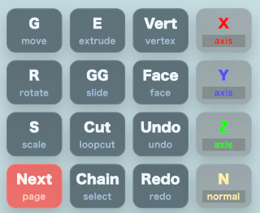
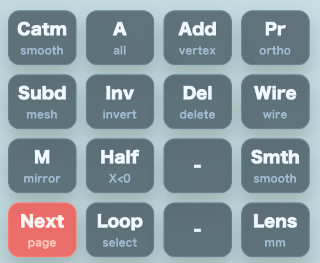
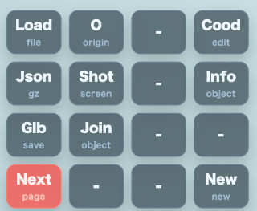
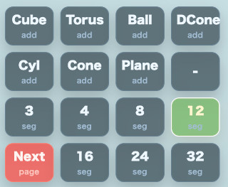

# mmodeler の使い方

[English](README.en.md) | 日本語

## 概要
mmodeler は、スマートフォンやタブレットのタッチ操作に最適化した、Blender風の3Dモデリングツールです。WebGPUとJavaScriptで構築されており、直感的なジェスチャー操作によって、カメラ制御、オブジェクト編集、プリミティブ（基本形状）の追加、ファイルの保存・読込などが可能です。動作に外部サーバは不要で、すべてローカル環境で完結します。

## モバイル操作体系
本ツールでは、編集画面（キャンバス）上での操作を以下のジェスチャーに割り当てています。PCではマウスで同様の操作が可能です。

- **ダブルタップ**: コマンド選択の基本操作
    - **図形上の場合**: 現在の選択状態を維持したままコマンドパレットを展開します。
    - **何もない領域の場合**: 矩形選択（ボックス選択）の準備状態になります（※シーンに頂点が存在しない場合はコマンドパレットを展開します）。
- **長押し**: 対象がある位置ではモード切り替え（オブジェクトモード $\leftrightarrow$ 編集モード）を行います。何もない領域では現在の状態が表示されます。
- **1本指ドラッグ**: カメラの回転（オービット）
- **2本指ドラッグ**: カメラの平行移動（パン）
- **ピンチ操作**: カメラのズーム
- **短いタップ**: 選択（オブジェクトモードではオブジェクト、編集モードでは頂点または面を選択）
- **↑ボタン**: 画面左上の Shift キー相当のトグルスイッチです。ONの間はタップによる「追加選択」となり、選択済みの要素を再度タップすると選択解除できます。

## コマンドパレット
ダブルタップで表示される 4x4 のグリッドメニューです。`Next` ボタンで計4ページのメニューを切り替えて使用します。パレットは操作位置を妨げないよう、画面中心からの相対位置に基づいて自動的に配置されます。

### 第1ページ：基本編集と軸制限
基本的な変形コマンドと、変形時の軸制限オプションを配置しています。

| ボタン | 解説 |
| --- | --- |
| `G` | **移動**: 選択中のオブジェクト、面、頂点を移動します。ボタン押下後、画面を1本指でドラッグして位置を確認し、短いタップで確定します。 |
| `E` | **押し出し**: 編集モードで選択中の面または頂点を押し出します。ドラッグで移動量を調整します。 |
| `Vert` | **頂点選択モード**: 編集モードの選択対象を「頂点」に切り替えます。頂点単位の移動、削除、追加、ループ選択に使用します。 |
| `X` | **X軸制限**: 次に実行する変形操作（G/R/S/E/GG）の方向をワールドX軸に制限します。もう一度押すと制限なし（Free）に戻ります。 |
| `R` | **回転**: 選択中のオブジェクト、面、頂点を回転させます。ドラッグで角度を確認し、タップで確定します。 |
| `GG` | **エッジスライド**: 選択頂点が2つの隣接頂点に挟まれた中点である場合、そのエッジの直線上でスライドさせます。 |
| `Face` | **面選択モード**: 編集モードの選択対象を「面」に切り替えます。面の押し出し、削除、ループカットなどを実行できます。 |
| `Y` | **Y軸制限**: 次に実行する変形操作（G/R/S/E/GG）の方向をワールドY軸に制限します。もう一度押すと制限なし（Free）に戻ります。 |
| `S` | **拡大縮小**: 選択中のオブジェクト、面、頂点をスケールさせます。ドラッグで倍率を確認し、タップで確定します。 |
| `Cut` | **ループカット**: 編集モードで選択した四角面を分割します。単一の面を選択している場合は、プレビュー線を見ながら方向を選択します。 |
| `Undo` | **元に戻す**: 直前の編集操作（変形、プリミティブ追加、削除など）を1つ取り消します。 |
| `Z` | **Z軸制限**: 次に実行する変形操作（G/R/S/E/GG）の方向をワールドZ軸に制限します。もう一度押すと制限なし（Free）に戻ります。 |
| `Next` | 次のページへ切り替えます。 |
| `Chain` | **チェーン選択**: 選択頂点から隣接エッジの方向を選び、四角面だけでつながる頂点列をタップで確定選択します。 |
| `Redo` | **やり直し**: `Undo` で戻した操作を再度実行します。 |
| `N` | **法線制限**: 編集モードで、選択面の平均法線方向、または選択頂点周辺の平均法線方向へ変形を制限します。もう一度押すと制限なしに戻ります。 |

### 第2ページ：選択・シーン操作・表示切替

| ボタン | 解説 |
| --- | --- |
| `Catm` | **Catmull-Clark細分化**: メッシュ全体を滑らかに細分化し、丸みのある形状にします。 |
| `A` | **全選択**: オブジェクトモードでは全オブジェクトを、編集モードでは全頂点または全面を選択します。 |
| `Add` | **頂点追加 / 面作成**: 3〜4個の頂点を選択中なら面を作成し、それ以外ではタップ位置に頂点を追加するツールに切り替わります。 |
| `Pr` | **投影切替**: 透視投影（Perspective）と平行投影（Orthographic）を切り替えます。正確な位置合わせには平行投影が便利です。 |
| `Subd` | **細分化**: 四角面のみのメッシュを1段階細分化し、面構造を保ったままポリゴン密度を上げます。 |
| `Inv` | **選択反転**: 現在の選択状態を反転させます。 |
| `Del` | **削除**: 選択中のオブジェクト、頂点、または面を削除します。 |
| `Wire` | **ワイヤーフレーム表示**: 表示を切り替えます。ONの間は、裏側にある頂点も選択対象になります。 |
| `M` | **Xミラー**: X=0 を基準としたミラー編集を有効にします。 |
| `Half` | **半分選択**: X座標が0より小さい側の要素を選択します。片側削除やミラー編集の準備に使用します。 |
| `Smth` | **スムーズシェーディング**: 陰影表示を滑らかに切り替えます。形状（頂点構造）は変えず、見た目だけを滑らかにします。 |
| `Lens` | **レンズプリセット**: カメラの画角（広角・標準・望遠）を切り替えて見え方を確認できます。 |
| `Next` | 次のページへ切り替えます。 |
| `Loop` | **ループ選択**: ループカットで作成された中点頂点から、カットライン方向に沿って頂点列を選択します。 |

### 第3ページ：ファイル操作・オブジェクト管理

| ボタン | 解説 |
| --- | --- |
| `Load` | **読み込み**: ローカルファイルからモデルファイルや保存済み ModelAsset JSON を読み込みます。 |
| `O` | **原点リセット**: 選択中オブジェクトの原点（Origin）をワールド原点へ戻します。形状は維持したまま基準点のみを整えます。 |
| `Cood` | **座標表示**: 編集モードで選択中の頂点座標をオーバーレイ表示します。単一頂点選択時は直接数値を入力して更新可能です。 |
| `Info` | **情報表示**: 選択オブジェクトのサイズ（バウンディングボックス）、頂点数、ポリゴン数、原点を表示します。タップで閉じます。 |
| `Json` | **JSON保存**: 現在のシーンを gzip 圧縮済み JSON (`.json.gz`) として保存します。再編集に最適な形式です。 |
| `Shot` | **スクリーンショット**: 現在の表示画面を画像として保存します。 |
| `Glb` | **GLB保存**: 現在のシーンを GLB 形式で書き出します。他の3Dツールやビューアで利用可能です。 |
| `Join` | **統合**: オブジェクトモードで選択中の2つ以上のオブジェクトを1つにまとめます。 |
| `Next` | 次のページへ切り替えます。 |
| `New` | **新規作成**: 現在のシーンを破棄し、空のシーンから開始します。 |

### 第4ページ：プリミティブ追加と分割数

| ボタン | 解説 |
| --- | --- |
| `Cube` | **立方体**: 中心に原点を持つ立方体を追加します。 |
| `Torus` | **トーラス**: ドーナツ状の形状を追加します。分割数設定がリングとチューブの密度に反映されます。 |
| `Ball` | **球体**: 中心に原点を持つ球体を追加します。分割数設定が経緯度の密度に反映されます。 |
| `DCone` | **二重円錐**: 上下に頂点を持つ円錐を追加します。中心のリングが原点高さに配置されます。 |
| `Cyl` | **円柱**: 中心に原点を持つ円柱を追加します。分割数設定が円周の密度に反映されます。 |
| `Cone` | **円錐**: 円錐を追加します。底面と頂点の中間がオブジェクト原点になります。 |
| `Plane` | **平面**: XZ平面に配置される平面を追加します。床面や押し出しのベースとして利用します。 |
| `3`〜`32` | **分割数設定**: プリミティブ作成時の密度を指定します。数値が大きいほど滑らかになりますが、編集点数が増え負荷が高まります（初期値: 12）。 |
| `Next` | 第1ページへ戻ります。 |

## 詳細機能仕様

### 変形操作 (Transform)
`G/R/S/E/GG` のいずれかを選択した後、1本指ドラッグでプレビューを行います。
- **確定**: 短いタップで確定します。
- **継続操作**: 指を離した時点では確定されず、その位置を基準に再度ドラッグして微調整を行うことが可能です。
- **エッジスライド (GG)**: 選択頂点が2つの隣接頂点に挟まれた中点である場合に限り、そのエッジの直線上でスライドさせます。

### ループカット (Loop Cut)
編集モードで四角面を選択して `Cut` を実行します。
- **伝播**: 選択した面を開始点として、隣接する四角面へ向かってカットを伝播させます。
- **方向選択**: 単一の面のみを選択している場合は、緑色のプレビュー線が表示されます。指を辺に近づけて方向を選び、タップで確定します。
- **X Mirror**: ON の場合、選択した側のカット方向を反対側のミラー面にも同時に適用します。

### ループ選択 (Select Loop)
`Loop` は、ループカットで作成された中点頂点列を効率的に選択するための機能です。
- **開始点**: ループカット後の中点頂点を「頂点選択モード」で選択してから実行します。
- **選択方向**: 選択頂点がエッジの中点であることを判定し、対辺側にある中点頂点へ向かって選択を広げます。
- **活用例**: `Cut` $\rightarrow$ `Loop` で中点列を選択し、そのまま `GG` でエッジに沿って位置調整を行う、といった使い方が可能です。

### 連続選択 (Chain Select)
`Chain` は、任意の頂点から隣接エッジの方向を指定し、四角面のみで繋がっている頂点列を選択します。
- **開始点**: 「頂点選択モード」で開始頂点を選択してから実行します。
- **方向選択**: プレビュー線を確認しながら方向（縦・横など）を選び、タップで確定します。
- **停止条件**: 立方体の角（90度）、三角面、五角面などに到達すると選択は停止します。

### 矩形選択 (Box Select)
図形が存在する状態で、何もない領域をダブルタップして開始します。
- **操作**: ドラッグで選択範囲をプレビュー表示します。
- **確定**: 指を離した後、範囲を確認し、タップで選択を確定します。
- **修正**: 確定前に再度ドラッグすることで、範囲を引き直せます。
- **キャンセル**: 準備中またはプレビュー中に再度ダブルタップすると、キャンセルされます。

### 細分化 (Subdivision)
- **Subd (単純細分化)**: 四角面のみのメッシュを1段階細分化します。1つの四角面を4つの四角面に分割します（三角面を含む場合は実行されません）。
- **Catmull-Clark (スムージング細分化)**: 面の中心点やエッジの中点を用いてメッシュを再構成し、滑らかな形状にします。ただし、非多様体（non-manifold）エッジや複雑な境界を持つ形状では実行されません。

### 選択・表示の仕様
- **マーカー**: 選択済みの頂点は赤く表示されます。また、両端の頂点が選択されているエッジも赤く表示されるため、ループ選択の結果を線として確認できます。
- **裏側選択**: `Wire` (ワイヤーフレーム) が ON の編集モードでは、視覚的に裏側に隠れている頂点も選択可能です。
- **陰影**: `Smth` は、頂点構造を変えずに表示上のシェーディングのみを滑らかにします。
- **追加選択**: 画面左上の `↑` ボタンが有効な間は、PC の Shift キーと同様に「追加選択」として動作します。

### ビュー dock (視点切り替え)
画面端（縦画面では上部、横画面では右端）に配置されたボタンで、以下の視点へ即座に切り替えられます。
- `X` / `-X`: 側面 / 反転側面
- `Y` / `-Y`: 上面 / 反転上面
- `Z` / `-Z`: 正面 / 反転正面

## Blender との連携
専用の Blender アドオン (`blender_modelasset_io.py`) を使用することで、mmodeler と Blender 間でデータをやり取りできます。

### 導入方法
1. Blender の `Edit > Preferences > Add-ons > Install...` から `blender_modelasset_io.py` をインストールします。
2. `Webg ModelAsset JSON I/O` を有効化します。

### データの受け渡し
- **mmodeler $\rightarrow$ Blender**: mmodeler で `Json` (gzip圧縮済みJSON) として保存し、Blender の `File > Import > Webg ModelAsset JSON` で読み込みます。
- **Blender $\rightarrow$ mmodeler**: Blender でメッシュを選択し、`File > Export > Webg ModelAsset JSON` で書き出し、mmodeler の `Load` で読み込みます。
- **軸変換**: 標準設定で、Blender の Z-up と mmodeler の Y-up を相互に変換します（設定で OFF にすることも可能です）。

## 読み込み時のステータス表示
`.json.gz` ファイルの読み込み時は、以下のプロセスが表示されます。
`decompressing` (展開) $\rightarrow$ `parsing` (解析) $\rightarrow$ `importing` (取り込み)
これにより、大容量ファイルの読み込み時でも現在の処理状況を確認できます。
