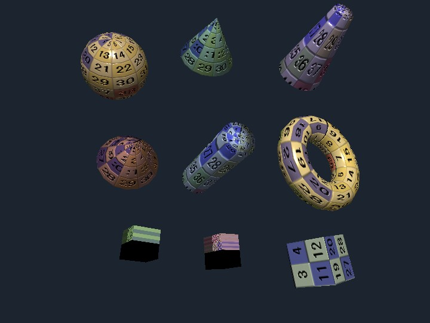

# model_shape

English | [日本語](README.md)

## Overview
- This sample validates the `ModelAsset` returned by `Primitive.js` with `ModelValidator`, converts it into `Shape` objects with `ModelBuilder`, and displays the result
- Multiple shapes are arranged with normal maps, but the main characteristic is that the shape-generation path is unified as `Primitive -> ModelAsset -> validate -> build` rather than writing `Shape` data directly
- `WebgApp.js` is used so initialization, message display, and the loop are collected through the high-level API

## How to Run
- Open [./model_shape.html](./model_shape.html)
- Use a browser with WebGPU support, and check the help panel and HUD together with the sample when needed

## webg Features Used
- `WebgApp`: standard initialization, render loop, and operation-guide display
- `Primitive`: generates basic primitives as `ModelAsset`
- `ModelAsset`: shared entry point for data representation
- `ModelValidator`: validates consistency of geometry, animation, nodes, and related data
- `ModelBuilder`: constructs `Shape` groups from `ModelAsset`
- `SmoothShader`: draws regular textures together with normal maps
- `Texture.buildNormalMapFromHeightMap`: generates a normal map from the same image

## Checkpoints
- Confirm that the `ModelAsset` returned by `Primitive` can be passed directly to the validator
- Confirm that normal-mapped rendering still works even for `Shape` objects created through `ModelBuilder`
- Compared with `shapes`, confirm that this sample is meant to follow the processing flow `Primitive -> ModelAsset -> validate -> build` rather than to compare visual appearance
- Confirm that toggling wireframe and toggling the normal map on or off does not break the display control even though the generation path changes

## Controls
- Drag / arrow keys: orbit camera rotation
- Mouse wheel / `[ / ]`: zoom
- `Space`: pause rotation
- `N`: toggle the normal map on or off
- `W`: toggle wireframe on or off
- `R`: return the camera to its initial position
