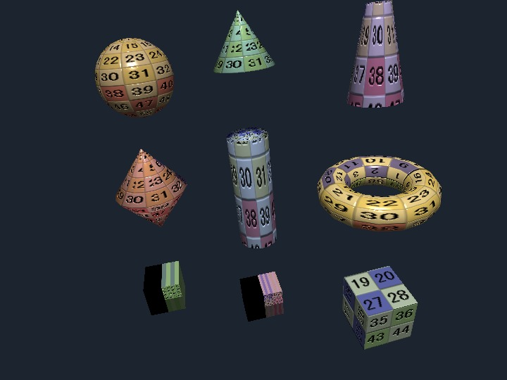

# model_shape

English | [日本語](README.md)

## Overview

This sample shows how primitive geometry becomes renderable through the
`ModelAsset` pipeline. It creates nine primitive assets; the `mapCube` data is
explicitly wrapped with `ModelAsset.fromData()`. `ModelValidator` checks each
asset, and `ModelBuilder` builds its runtime Shapes. The app attaches each Shape
to a Node, applies color and normal maps, and displays the nine objects in a grid.

## How to Run
- Open [./model_shape.html](./model_shape.html)
- Open the page in a WebGPU-enabled browser. The HUD lists the available controls and current display settings.

## webg Features Used
- `WebgApp`: standard initialization, render loop, and operation-guide display
- `Primitive`: generates the primitive geometry used by each `ModelAsset`
- `ModelAsset`: shared data format for model geometry, materials, and nodes
- `ModelValidator`: validates consistency of geometry, animation, nodes, and related data
- `ModelBuilder`: constructs `Shape` groups from `ModelAsset`
- `SmoothShader`: draws regular textures together with normal maps
- `Texture.buildNormalMapFromHeightMap`: generates a normal map from the same image

## Checkpoints

- Check that all nine model assets pass `ModelValidator` before `ModelBuilder` builds them.
- Toggle the normal map and wireframe to compare the resulting Shapes.
- Compare this data flow with [shapes](../shapes/index.en.html), which focuses on the appearance of primitive geometry and normal maps.

## Controls
- Drag / arrow keys: orbit the camera
- Mouse wheel / `[ / ]`: zoom
- `Space`: pause rotation
- `N`: toggle the normal map on or off
- `W`: toggle wireframe on or off
- `R`: return the camera to its initial position
