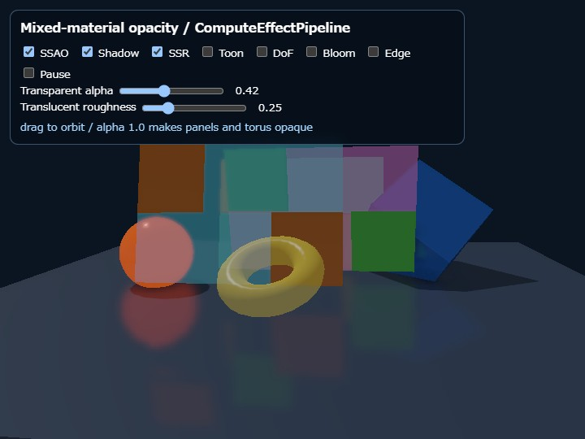

# opacity

English | [日本語](README.md)



## Overview

`opacity` demonstrates opaque and translucent materials in one `Shape`, with a material slot selected per triangle. Each checker panel is one `Shape`: orange-like cells use material slot 0 and blue-like cells use material slot 1. Adjacent triangles share vertices; vertices are not duplicated just to change the material.

`Shape.setMaterial()`, `Shape.getMaterial()`, and `Shape.updateMaterial()` operate on material slot 0. Additional materials use `setMaterialAt(index, id, params)`, `getMaterialAt(index)`, and `updateMaterialAt(index, params)`. The fourth argument of `addTriangle(a, b, c, materialIndex)` selects the slot. Its default is 0.

## Rendering flow

A material is classified as opaque when `alpha` is 1.0 and translucent when it is below 1.0. Opaque triangles render first with depth writes enabled. Translucent triangles are collected from every `Shape`, sorted back-to-front by the view-space Z of each triangle centroid, and then rendered with depth testing enabled, depth writes disabled, and source-over alpha blending.

This sample combines `WebgApp` with `ComputeEffectPipeline`. Application code does not insert a transparency Render Pass. `renderScene()` records only opaque triangles in the G-buffer. After Deferred Lighting and SSR, `encode()` composites translucent triangles into the HDR scene color. Toon, DoF, Bloom, Tone Map, and Edge then process the composited image. When the scene has no translucent triangles, the transparency HDR copy and Render Pass are skipped automatically.

## Running the sample

- Open [./opacity.html](./opacity.html)
- Drag with a mouse or touch to orbit the camera
- Toggle `SSAO`, `Shadow`, `SSR`, `Toon`, `DoF`, `Bloom`, and `Edge` independently
- Move `Transparent alpha` from 0.0 to 1.0. The same value is written to material slot 1 of the checkerboard panels and material slot 0 of the yellow torus; at 1.0, both move to the opaque path on the next frame
- Move `Translucent roughness` from 0.04 to 1.0 to write a roughness value to every translucent material on the checkerboard panels and yellow torus
- Enable `Pause` to compare composition at a fixed panel and camera position

## What to verify

Look through a foreground translucent cell and verify that opaque cells and other translucent cells remain visible behind it. As the camera and panels move, sorting covers triangles across every Shape rather than sorting whole Shapes. At `alpha=1.0`, the same material slot 1 triangles move into the G-buffer and depth-writing path, so no transparency composition is needed.

A yellow translucent torus with an outer diameter of 3.0, made from an independent Shape, is placed near the camera at the center of the screen. Where this torus overlaps a checkerboard panel, translucent triangles from different Shapes are also composited from back to front. `Transparent alpha` changes the translucent materials of both the torus and checkerboard panels, allowing cross-Shape composition to be compared at the same Alpha. At Alpha 1.0, every controlled triangle, including the torus, is classified into opaque rendering automatically.

`Translucent roughness` writes the same value to material slot 1 of each checkerboard panel and material slot 0 of the torus. At 0.04, the background remains nearly sharp and the Specular highlight is narrow and sharp. As the value approaches 1.0, the Specular highlight becomes wider and weaker while the background seen through translucent surfaces becomes strongly blurred. Compare the highlight on the torus, the area around its hole, and the sphere or boundaries seen through the checkerboard panels to distinguish the Roughness change from Alpha.

`TransparencyPass` creates medium and strong Compute-blurred images from the HDR scene color before transparency composition. It then builds a Roughness mask from translucent triangles across every Shape and composites the sharp background with the two blur levels using material roughness alone. Material Alpha does not attenuate this background composition. Finally, the sorted translucent triangles add their surface color and Specular contribution with normal Alpha Blend. `ComputeEffectPipeline` performs all of these stages automatically; application code does not insert `FrostedGlassPass` or another Render Pass.

With Bloom enabled, the emissive sphere on the left and the composited scene, including translucent regions, receive the glow effect. DoF, Toon, and Edge also run after transparency composition. SSAO, Shadow, and SSR are G-buffer effects, however, so they evaluate opaque surfaces and the translucent surfaces are composited afterward. Translucent surfaces do not write the G-buffer, opaque depth, or shadow map.

## Limitations

The order is an approximation based on triangle-centroid view-space depth. There is no unique correct whole-triangle order for intersecting translucent triangles, interpenetrating layers, or cyclic ordering where A is behind B, B is behind C, and C is behind A. This process does not split triangles or use Weighted Blended OIT, so intersections and cycles are out of scope.

Translucent triangles normally require one draw call per triangle, so this path is not intended for finely tessellated transparent meshes covering large areas. Use normal `WebgApp` rendering for a simple scene and `WebgApp + ComputeEffectPipeline` when the scene needs Deferred Lighting or compute effects. Both rendering paths use the same transparent material API.

The Frost blur source is made from the opaque HDR scene immediately before translucent triangles are composited. A foreground translucent surface does not re-blur only the translucent layers that have already been composited behind it. Exact refraction and repeated blur through multiple translucent layers are out of scope, like complex intersections and cyclic ordering between translucent surfaces.

## API example

```js
const shape = new Shape(gpu);
shape.setMaterial("smooth-shader", {
  color: [1.0, 0.5, 0.1, 1.0],
  alpha: 1.0
});
shape.setMaterialAt(1, "smooth-shader", {
  color: [0.1, 0.7, 1.0, 1.0],
  alpha: 0.42
});

const a = shape.addVertex(-1, -1, 0) - 1;
const b = shape.addVertex( 1, -1, 0) - 1;
const c = shape.addVertex( 1,  1, 0) - 1;
const d = shape.addVertex(-1,  1, 0) - 1;
shape.addTriangle(a, b, c, 0);
shape.addTriangle(a, c, d, 1);
shape.endShape();
```

`alpha` must be a finite value from 0.0 through 1.0. A missing material slot or a skipped slot number also throws instead of being silently changed to slot 0, making configuration errors visible before they become ambiguous rendering artifacts.
