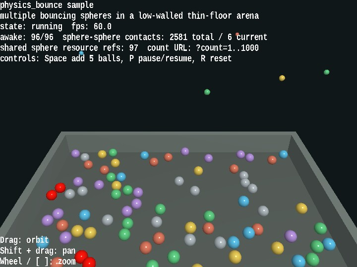

# physics_bounce

[English](README.en.md) | 日本語

## 概要
- PhysicsSpace の中で複数の sphere が床、壁、球同士で反発しながら跳ねる見え方を確認するサンプルです
- WebgApp を使って起動、HUD、入力、camera 操作をまとめ、物理本体の構成は PhysicsNode と Collider の組み合わせとして追えるようにしています
- 球は shared ShapeResource を使う instance shape で描画し、?count=1000 まで増やしても「物理 body は個別、描画 mesh は共有」という構成を確認しやすくしています
- 床は PlaneCollider、壁は BoxCollider、球は SphereCollider とし、plane-sphere、sphere-sphere、sphere-box の反発差を同じ arena の中で比較できます
- Space キーで球を追加投入し、既存の球群に途中から衝突させることで、単発の落下だけでなく混み合った反発の見え方も確認できます

## 実行方法
- 実行ファイルは [./physics_bounce.html](./physics_bounce.html) です
- WebGPU に対応したブラウザで開き、必要に応じて help panel や HUD と合わせて確認してください

## 使用している webg 機能
- WebgApp: Screen、Shader、Space、Input、Message の初期化をまとめる
- PhysicsSpace: 重力、固定タイムステップ、反発、摩擦、sleep を管理する
- PhysicsNode: dynamic body と static body の配置、および速度リセットを行う
- SphereCollider、PlaneCollider、BoxCollider: 球、床、壁の衝突形状を構成する
- Shape と Primitive: sphere、床、壁の mesh を作る
- EyeRig: orbit camera と pointer / キーボードによる視点操作を担当する

## 確認ポイント
- 球が床で跳ね返るとき、反発係数の差によって跳ね返り高さが変わることを確認します
- 球同士の接触が起きた瞬間だけ赤く flash し、床 contact だけでは赤くならないことを確認します
- shared sphere resource の参照数が HUD に表示され、球数が増えても球 mesh を共通化していることを確認できます
- ドラッグ、Shift + ドラッグ、ホイール で camera を動かしても、arena 全体の反発の流れを見失いにくいことを確認します
- ?count= で球数を増減したとき、軽い確認から高密度の反発確認まで同じサンプルで扱えることを確認します

## 操作方法
- ドラッグ: orbit camera
- Shift + ドラッグ: pan
- ホイール / [ / ]: zoom
- Space: 球を 5 個追加する
- P: 一時停止 / 再開
- R: 球を初期状態へ戻す
- ?count=240 のように URL へ付けると、初期球数を変更できます

## 実装の詳細
- 反発、摩擦、sphere-sphere 接触、sphere-box 接触の挙動を見るときは、このサンプルで跳ね返り高さ、赤い contact flash、壁際の反応を確認できます
- shared sphere resource refs は描画 mesh の共有が維持されているかを見る目安です
- PhysicsSpace の契約確認そのものは unittest/physics_space_contracts が担当し、このサンプルは見え方と相互作用の確認を担当します
