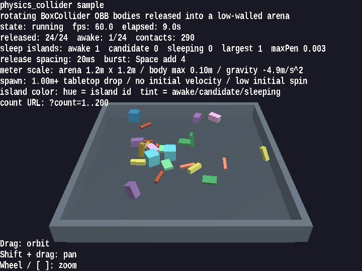

# physics_collider

[English](README.en.md) | 日本語

## 概要
- BoxCollider を持つ複数の body が、回転しながら落下し、空中や床上で接触し、押し合いながら落ち着いていく見え方を確認するサンプルです
- WebgApp を使って起動、HUD、入力、camera 操作をまとめつつ、物理 world 自体は PhysicsSpace と PhysicsNode を直接組んでいるため、実装の追跡もしやすい構成です
- 1 unit = 1m を前提に、1.2m x 1.2m の浅い arena へ最大 0.10m 程度の box を投入し、卓上の小物を落とすようなスケール感で挙動を確認できます
- 立方体だけでなく beam、plate、column、deep block を混ぜることで、OBB の向き変化、辺接触、面接触、sleep island の見え方を比較しやすくしています
- Space キーで box を追加投入し、密度を上げた状態でも回転付き contact がどう落ち着くかを確認できます

## 実行方法
- 実行ファイルは [./physics_collider.html](./physics_collider.html) です
- WebGPU に対応したブラウザで開き、必要に応じて help panel や HUD と合わせて確認してください

## 使用している webg 機能
- WebgApp: Screen、Shader、Space、Input、Message の初期化をまとめる
- PhysicsSpace: 固定タイムステップ、重力、反発、摩擦、sleep island を管理する
- PhysicsNode: dynamic / kinematic / static の切り替え、および姿勢と速度の初期化を行う
- BoxCollider と PlaneCollider: 回転付き box と床 plane の接触を構成する
- Shape と Primitive.cuboid(): 各 body、床、壁の mesh を作る
- EyeRig: orbit camera による俯瞰視点の確認を担当する

## 確認ポイント
- 長い beam や平たい plate が、見た目の回転と collider の向きがずれずに落下することを確認します
- box 同士が空中や床上で接触したときに、単に通り抜けず、押し戻しと回転変化が見えることを確認します
- status に release 数、awake 数、contact 数、sleep island 集計が表示され、全体がどこまで落ち着いたかを追えることを確認します
- sleep island ごとの色相変化により、同じ島に属する body と、awake / candidate / sleeping の違いを見分けやすいことを確認します
- ドラッグや zoom で視点を変えても、卓上スケールの arena と body サイズが直感的に把握しやすいことを確認します

## 操作方法
- ドラッグ: orbit camera
- Shift + ドラッグ: pan
- ホイール / [ / ]: zoom
- Space: box を 4 個追加する
- P: 一時停止 / 再開
- R: 位置、姿勢、速度を初期状態へ戻す
- ?count=60 のように URL へ付けると、初期 body 数を変更できます

## 実装の詳細
- 見え方ではなく solver の数値を追いたい場合は unittest/physics_collider/headless_probe.js を node で実行してください
- headless_probe.js は standing beam や cube corner balance の数値調査に使います。このサンプルは画面上の相互作用確認、headless probe は数値診断という役割分担です
- PhysicsSpace の契約確認は unittest/physics_space_contracts が担当し、このサンプルは回転付き box 接触の見え方を担当します
