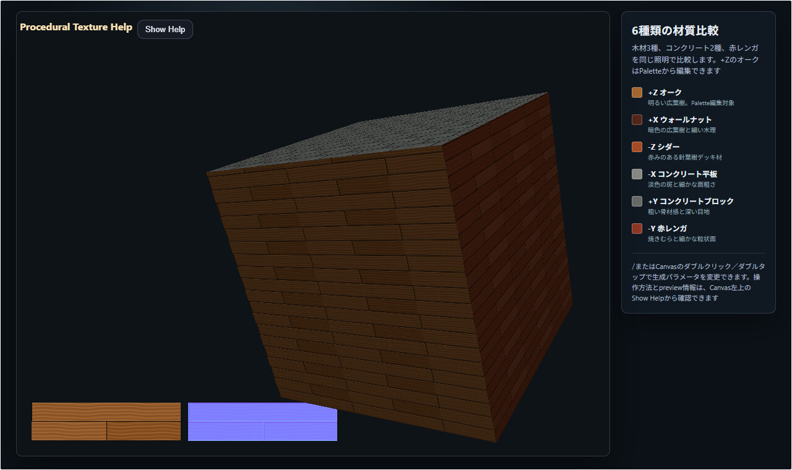

# procedural_texture

English | [日本語](README.md)

## Overview

This sample compares Color and Height maps generated by `ProceduralTiledSurface` across the six faces of a cube. A Normal map is derived from each Height map. Seven presets—three woods, two concretes, red brick, and glossy vinyl tile—can be inspected under the same geometry and lighting.

The initial six faces show three woods, two concretes, and red brick. The +Z face can be changed directly to any of the seven presets, including vinyl tile. Periodic Perlin fBm from the independent CPU reference class drives wood-grain warping, concrete mottling, brick firing variation, marble, Voronoi warping, Cloudy, and Linen recipes. Terrazzo places monochrome chips through coordinate hashes from `util.js`.

Each preset has a material-specific `variationCell`. Oak and Cedar use two long units by four rows, Walnut uses two long units by six rows so its 1/3 running-bond period closes, the concrete block uses two by four, the stack-laid concrete panel uses one panel by one row, brick uses 4 by 8, and square vinyl tile uses 4 by 4. The initial wood layouts are running-bond with 1/2 for Oak, 1/3 for Walnut, and 1/4 for Cedar. A unit crossing a tile boundary is folded onto one variation ID, so its color and pattern phase do not change halfway through the unit.

This sample is the CPU reference implementation. Use the higher-level [`texture_catalog`](../texture_catalog/README.en.md) sample for WebGPU Compute generation, material editing, previews, and completed-definition export.

## Running the sample

Open [./procedural_texture.html](./procedural_texture.html) in a WebGPU-capable browser. Drag to orbit around the cube. Use the wheel or pinch gesture to change the distance and inspect Normal-map shading around the joints at close range. Press `/`, or double-click/double-tap the Canvas, to open the Command Palette and change generation parameters while the sample is running.

## webg features used

`WebgApp` coordinates GPU initialization, the render loop, Canvas, and input. `WebgApp.createOrbitEyeRig()` connects drag, wheel, and touch gestures to one orbit-camera state.

`buildHelpPanelOptions()` and `showOverlayPanel()` place the sample name, map-generation flow, preview order, and controls in one HelpPanel. Its body starts hidden and opens only when `Show Help` is selected at the upper left of the Canvas. Keeping this information out of an always-visible Canvas font HUD leaves the cube and texture previews unobstructed.

`CommandPalette` edits the +Z face through five pages, with `Prev` at the upper left and `Next` at the upper right of every page. The first page provides seven direct preset buttons. Later pages edit dimensions, color, joint width, a white-to-dark-gray joint tone, variation columns and rows, and material patterns. Row Offset directly selects 0, 1/2, 1/3, or 1/4. Pattern mode directly selects Wood, Concrete, Brick, Marble, Voronoi, Cloudy, Linen, Terrazzo, or None.

`Background` draws the editable +Z face's Color and Normal textures in the lower-left background behind the 3D geometry. It automatically selects a horizontal or vertical arrangement when both maps fit at 1:1. If neither arrangement fits, it preserves the aspect ratio and scales both maps down. It never crops or tints them.

`Shape` builds one cube from 24 vertices and 12 triangles, assigning six material slots by face. Each face assigns repeating UVs to four vertices with `addVertexUV()` and registers them as one quad with `addPlane()`. Before adding those vertices, `setTextureMappingMode(1)` explicitly selects planar mapping so a U value greater than one, which represents repetition, is not adjusted as a spherical-UV seam. Each slot refers to a separate Color texture and Normal texture, so one Shape can show a different procedural configuration on every face.

`Texture.setImage()` uploads the CPU-generated Color and Height maps. `Texture.buildNormalMapFromHeightMap()` derives a Normal map from neighboring Height-map pixels. The Normal-map slope is calculated from the Height map's physical range and the physical size of one pixel, preventing a resolution-only change from greatly changing the apparent slope.

Fine dirt and relief are generated in one periodic `Float32Array` through `PerlinNoise2D.fillFbm()` and read by the Color/Height loop. The editable +Z face keeps an LRU cache of at most two fields, so palette changes that do not affect field coordinates can reuse the same surface-detail values. This field is CPU-only intermediate data; one Normal map is still derived from the final Height map.

## Generator structure

`ProceduralMaterials.resolve()` reads complete presets from the core `webg/ProceduralMaterials.js` module and validates them through `ProceduralTileSpec`. This CPU reference sample exposes seven choices from the twenty-three core presets, while pattern editing provides twelve modes including quarter-sawn, flat-sawn, and mixed grain. The preset selected in the Command Palette and its overrides are applied only to +Z. Unknown presets, unknown fields, and out-of-range values raise errors instead of being replaced with nearby or default values.

## Command Palette parameters

Page 1 directly selects one of the seven presets. Page 2 controls pixels per meter, unit dimensions, long-axis direction, layout, and row offset. Page 3 controls base color, unit variation, and dirt color. Page 4 controls dirt, monochrome joint tone, depth, edge rounding, joint width, and variation columns and rows. Page 5 directly selects the nine Pattern modes independently of the material preset.

Joint width accepts 0 m. At zero width, joint color, joint depth, and edge rounding are all excluded from generation, so no joint-related relief remains.

The Joint width buttons use one texture pixel as their step. At 100, 200, and 400 pixels/m, the steps are 10 mm, 5 mm, and 2.5 mm respectively.

Default face dimensions are 1800×150 mm flooring, 1800×900 mm concrete panel, 390×190 mm concrete block, 210×100 mm brick, and 300×300 mm vinyl tile. Supplied thickness values are retained as preset metadata and in F9 JSON. Planar textures are generated from face dimensions and pattern settings.

`Reset` on pages 2–5 restores the currently selected preset, while `Next` advances to the next page. `Pixels / meter` offers 100, 200, and 400 so dimensions such as a 0.01 m joint can be converted to an exact pixel count. Selecting `Stack` for `Layout` changes the row offset to zero, as required by the stack-layout definition.

## Exporting settings as JSON

Press `F9` followed by `M` to show the DebugDock. Use `Copy JSON` in the Dock, or press `F9` followed by `V`, to copy a diagnostics report containing the current Command Palette values at `context.proceduralTexture.paletteSettings`. It also records the variation cell, preview layout, and the latest CPU generation, texture/Normal, and total timings. Palette changes regenerate only +Z and reuse the five fixed comparison textures.

`ProceduralTiledSurface.generate()` calculates unit placement, joint positions, coordinates inside each unit, and deterministic random values once. It then generates Color and Height maps from the same placement data. Color dirt is not automatically copied into the Height map, so a dark stain does not incorrectly become a recess.

`ProceduralTextureSet.create()` creates Color, Height, and Normal `Texture` objects. The Normal map is derived from the Height map gradient. Whole-surface `roughness` is not part of the procedural texture output and remains an ordinary material value.

## Long axis and UVs

Unit dimensions use `shortSizeMeters` and `longSizeMeters`, while `longAxis` explicitly selects `"u"` or `"v"`. Wood grain creates tonal layers from the short coordinate and warps those layers with the long coordinate. The resulting grain runs along the length of the unit.

Each face's UV endpoint is calculated by dividing the 3 m face size by the generated texture tile's physical size. The texture is repeated as many times as required without stretching the physical unit or joint dimensions to fit the face. The initial camera distance is 6.75 m for a closer view of the 3 m cube.

## What to inspect

- Confirm that oak, walnut, and cedar differ in color, board width, and grain scale
- Confirm that wood grain flows along the length of the board
- Confirm that concrete slab and block surfaces have directionless mottling and roughness, not wood grain
- Confirm running-bond placement, firing variation, and granular relief on the red brick
- Confirm square joints, Marble, Voronoi, Cloudy, Linen, and Terrazzo styling, a nearly flat Normal map, and a glossy response on vinyl tile
- Confirm that Color-map joints and Normal-map recesses occupy the same positions on every face
- Confirm that repeated tile boundaries do not produce discontinuous color or normal lines
- Confirm that the lower-left background previews show the complete +Z Color and Normal maps at the same scale, using a vertical layout for the default settings

## Controls

- Drag: orbit around the cube
- Two-finger drag: pan the target
- Wheel or pinch: zoom
- Arrow keys: orbit
- `[` / `]`: zoom
- `/` or Canvas double-click/double-tap: open the Command Palette
- Command Palette `Next`: advance to the next page
- Command Palette `Reset`: restore the preset base values
- `F9` followed by `M`: toggle the DebugDock
- `F9` followed by `V`: copy diagnostics JSON containing the Palette settings
- `Show Help` / `Hide Help`: toggle the HelpPanel
