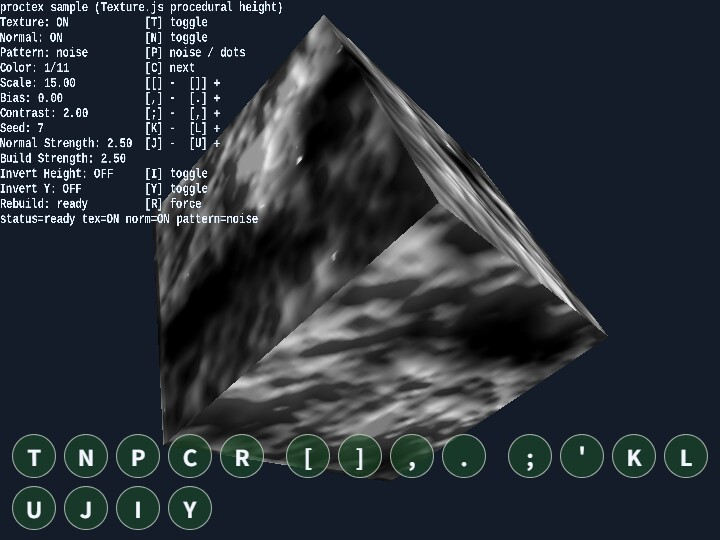

# proctex

English | [日本語](README.md)

## Overview
- Built on `WebgApp`, this sample lets you inspect procedural height-map generation and normal-map generation from `Texture.js` at the same time
- It uses the same height map both as a color texture and as a normal map, then displays a slowly rotating cube created with `Shape.mapCube` in the center of the screen
- By using `WebgApp` input and HUD, the sample keeps the key-operation guide and the current parameters visible in the same screen

## How to Run
- Open [./proctex.html](./proctex.html)
- Use a browser with WebGPU support, and check the help panel and HUD together with the sample when needed

## webg Features Used
- `Texture.makeProceduralHeightMapPixels`: procedural height-map generation
- `Texture.buildNormalMapFromHeightMap`: normal-map generation from the height map
- `Shape.mapCube`: UV-unwrapped cube
- `SmoothShader`: texture + normal-map rendering
- `InputController / Touch`: unifies keyboard input and touch-button input
- `WebgApp` HUD: displays the operation guide and current parameters

## Checkpoints
- Confirm that the appearance changes immediately when texture on/off and normal-map on/off are toggled
- Change `pattern / scale / contrast / bias / seed` and confirm that the generated pattern is rebuilt
- Confirm that changing `normal strength` changes how strongly the surface relief is emphasized
- Confirm that touch buttons are shown even on desktop and that the same key operations can be pressed there directly

## Controls
- `T`: toggle texture on or off
- `N`: toggle the normal map on or off
- `P`: switch the pattern (`noise / dots`)
- `C`: switch the shader color preset
- `[ / ]`: decrease / increase scale
- `, / .`: decrease / increase bias
- `; / '`: decrease / increase contrast
- `K / L`: decrease / increase seed
- `U / J`: increase / decrease normal strength
- `I`: toggle `invertHeight` on or off
- `Y`: toggle `invertY` on or off
- `R`: force regeneration with the current parameters, although regeneration normally happens automatically
- The touch buttons are shown with the same key assignments and can be inspected directly even on desktop

## Regeneration Behavior
- `P / [ / ] / , / . / ; / ' / K / L / I / Y` trigger automatic regeneration when changed
- `R` is used when you want to explicitly rerun regeneration while keeping the same parameters
