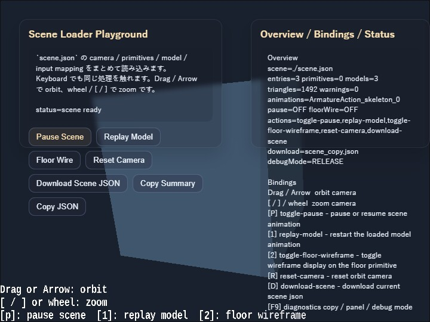

# scene

English | [日本語](README.md)

## Overview
- This sample loads a Scene JSON file with `SceneAsset.load()` and displays it as-is by passing it through `WebgApp.validateScene()` and `WebgApp.loadScene()`
- Camera, primitives, models, HUD, and input mapping are collected inside a single scene definition, while the JavaScript side implements only the action handlers
- An `OverlayPanel`-based DOM UI is also layered on top of the screen so Scene JSON actions can be triggered from buttons as well. This makes it easier to compare the connection between the scene-side input definitions and the JavaScript-side handlers

## How to Run
- Open [./scene.html](./scene.html)
- Use a browser with WebGPU support, and check the help panel and HUD together with the sample when needed

## webg Features Used
- `WebgApp`: standard initialization, render loop, and Scene JSON loading
- `SceneAsset.load`: loads the Scene JSON file
- `WebgApp.validateScene`: validates the Scene JSON
- `WebgApp.loadScene`: places the scene into the current app
- `SceneLoader`: restores camera / HUD / primitives / models / input mapping
- `SceneValidator`: schema validation with path information
- `ModelAsset`: intermediate representation for models inside the scene
- `ModelBuilder`: converts models / primitives in the scene into runtime shape groups
- `EyeRig(type="orbit")`: viewpoint control for looking around the entire scene
- `Message`: displays `hud.guideLines / hud.statusLines` from the Scene JSON as the HUD

## Checkpoints
- Confirm that the validator passes for `scene.json` and that camera, HUD, primitives, models, and input can all be loaded together
- Confirm that `hud.guideLines / hud.statusLines` in `scene.json` are explicitly described as objects with `x / y / text / color` for each row
- Confirm that the floor primitive and marker primitive are displayed and that primitive definitions can be placed through `SceneLoader`
- Confirm that the model loaded from `../json_loader/modelasset.json` appears in the same scene, showing that the existing `ModelAsset` path can also be reused from the scene side
- Confirm that the action buttons in the left `OverlayPanel` can run `pause / replay / floor wire / reset / download`, and that they invoke the same processing flow as the keyboard shortcuts
- Confirm that the `p, 1, 2, r, d` actions reach the JavaScript-side handlers through `sceneRuntime.createInputHandler()`, showing that the Scene JSON input mapping is used as metadata
- Confirm that `p` toggles pause / resume for all animations of the model inside the scene
- Confirm that `1` restarts the model animation from the beginning
- Confirm that `2` toggles the floor primitive wireframe display
- Confirm that `r` returns the orbit camera to the initial angles and distance defined by the scene
- Confirm that `d` can download the current Scene JSON again, serving as a minimal entry point for scene export
- Confirm that the right `OverlayPanel` shows the scene file, entry count, primitive count, model count, action names, and validator warning count, making the load state of the Scene JSON visible on screen

## Controls
- Drag / arrow keys: orbit camera rotation
- Mouse wheel / `[ / ]`: zoom
- Upper-left buttons: `Pause Scene`, `Replay Model`, `Floor Wire`, `Reset Camera`, `Download Scene JSON`
- `P`: pause / resume scene animation
- `1`: restart the model animation
- `2`: toggle floor wireframe
- `R`: return the camera to its initial position
- `D`: download the current Scene JSON
