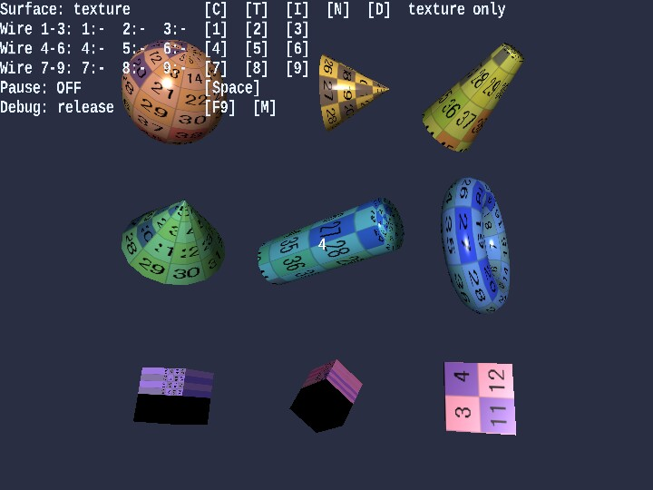

# shapes

English | [日本語](README.md)

## Overview
- Among the primitive-oriented samples, this is the main entry point for comparing the appearance of textures, image-based normals, and procedural normals in one place
- You can compare "textured appearance", "normal-map differences", and `wireframe` while keeping the same composition
- `Message` is used only for the numbered labels in the `3x3` layout, while operation guidance and status display are handled by the standard HUD on the `WebgApp` side

## How to Run
- Open [./shapes.html](./shapes.html)
- Use a browser with WebGPU support, and check the help panel and HUD together with the sample when needed

## webg Features Used
- `Primitive`: generates basic shapes such as sphere / cone / donut / cube
- `Shape.setWireframe`: toggles wireframe display
- `Texture`: loads `num256.png`
- `Texture.buildNormalMapFromProceduralHeight`: generates noise / dots normal maps
- `SmoothShader`: handles `texture + normal map` and `wireframe` through the same entry point. Flat shading can also be toggled as a function on the shader side
- `Message`: overlays only the primitive number labels in the `3x3` arrangement

## Checkpoints
- When switching the surface mode with `C / T / I / N / D`, confirm that only the differences between texture / image normal / procedural normal change while the geometry stays the same
- Confirm that texture comparison with `T`, image-normal comparison with `I`, and procedural-normal comparison with `N / D` can all be read within the same sample
- Confirm with the `1 - 9` wireframe toggles that the topology is as expected, and that line display does not break even when the surface mode changes
- Confirm that across the nine shapes, including `cube / cuboid / mapCube`, both texture and normal comparison remain usable without severe breakage

## Controls
- `C`: solid-color display
- `T`: texture display
- `I`: image-normal display
- `N`: noise-normal display
- `D`: dots-normal display
- `1 - 9`: toggle wireframe for the corresponding shape on or off
- `Space`: pause or resume rotation
- Touch buttons: `C / T / I / N / D`, `1 - 9`, and `Pause` use the same key names as the keyboard controls
