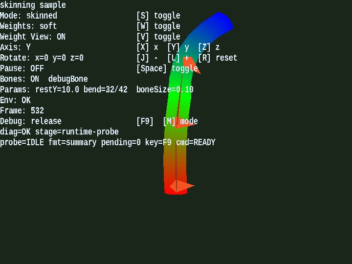

# skinning

[English](README.en.md) | 日本語

## 概要
- ウェイト分布や回転軸を切り替えながら、スキニング変形を詳細に観察する教材向けサンプルです。
- static、soft、hard、weight view を切り替え、同じ形状でスキニングの見え方だけを比較できます。

## 実行方法
- 実行ファイルは [./skinning.html](./skinning.html) です
- WebGPU に対応したブラウザで開き、必要に応じて help panel や HUD と合わせて確認してください

## 使用している webg 機能
- WebgApp: 画面表示、入力、操作案内の初期化
- Skeleton / Shape.addVertexWeight
- SmoothShader: static / skinned / weight_debug の共通入口
- Space.drawBones: ボーン描画
- その場で比較できる live mode 切り替え

## 確認ポイント
- hard/soft ウェイト切り替え時に曲げ境界の連続性がどのように変化するかを確認し、用途別の重み設計を検討します
- 軸切り替えと回転操作に対して変形が期待どおりに起きるかを確認し、ローカル軸解釈の誤りを検出します
- S / W / V を押した瞬間に表示が切り替わり、static / soft / hard / weight debug を往復比較しやすいことを確認します

## 操作方法
- S: staticモード切り替え
- W: 重みモード hard/soft 切り替え
- V: ウェイト可視化ON / OFF
- X / Y / Z: オブジェクト回転軸を選択
- J / L: 選択中軸でオブジェクト回転
- R: オブジェクト回転をリセット
- Space: bone animation の一時停止 / 再開
