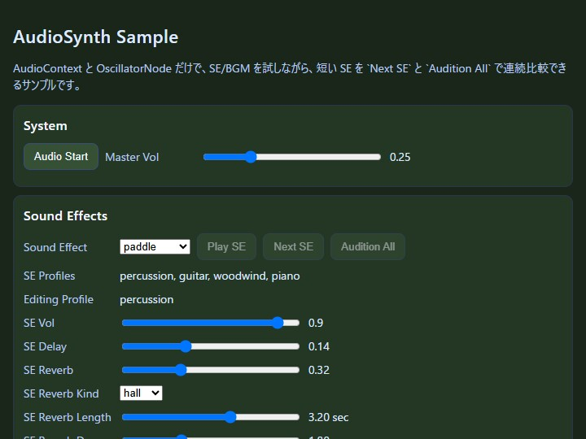

# sound

English | [日本語](README.md)

## Overview
- This sample uses `AudioSynth` and `GameAudioSynth` so you can inspect sound effects and BGM while adjusting them on the same screen
- After starting the `AudioContext` with `Audio Start`, you can play sound with `Play SE`, `Next SE`, `Audition All`, and `BGM Start`, then adjust volume, delay, reverb, envelope, and melody on the spot
- The sample is arranged so you can go back and forth on a single screen between "what to play" and "how to shape what it sounds like"

## Reading the Screen

The screen is divided into `System`, `Sound Effects`, and `Background Music`. In that order, you first start the `AudioContext`, then adjust sound effects, and finally adjust melody, BPM, BGM envelope, and BGM reverb directly to refine the detailed contour of the BGM.

`System` contains `Audio Start` and `Master Vol`. `Audio Start` is the button that starts `AudioContext` after a user gesture, matching browser restrictions. `Master Vol` is the baseline for the overall volume. Adjusting that first makes it easier to compare the relative balance between sound effects and BGM.

In `Sound Effects`, you choose the effect to play through `Sound Effect`, then play it with `Play SE`. `Next SE` advances through the catalog one item at a time, while `Audition All` plays the full catalog in sequence so you can compare the differences. `SE Profiles` shows the envelope profiles used by that effect, and `Editing Profile` shows the profile currently being edited by the sliders. `SE Vol`, `SE Delay`, `SE Reverb`, `SE Reverb Kind`, `SE Reverb Length`, `SE Reverb Decay`, `SE Envelope`, `SE Attack`, `SE Decay`, `SE Sustain`, and `SE Release` let you change the contour and spatial character of the same sound effect in considerable detail.

In `Background Music`, you work with `BGM Start`, `BGM Stop`, `BGM Vol`, `BPM`, `Melody`, `BGM Delay`, `BGM Reverb`, `BGM Reverb Kind`, `BGM Reverb Length`, `BGM Reverb Decay`, `BGM Attack`, `BGM Decay`, `BGM Sustain`, and `BGM Release`. Because BGM changes its progression itself through melody and BPM, it is different from SE and is better adjusted while listening to the flow of time.

## How to Run
- Open [./sound.html](./sound.html)
- Use a browser with WebGPU support, and check the help panel and HUD together with the sample when needed

## webg Features Used
- `GameAudioSynth`: handles the game-oriented sound-effect catalog and melody presets together
- `AudioSynth`: handles envelope, delay, reverb, and IR settings for SE and BGM

## Checkpoints
The first thing to do is press `Audio Start`. Once sound output is enabled, use `Sound Effect` and `Play SE` to inspect short effects, then use `BGM Start` to play a melody. If you want to inspect the contour of the sound, change `SE Envelope`. If you want to inspect spatial character, change `SE Reverb Kind`, `SE Reverb Length`, and `SE Reverb Decay`. If you want to inspect the flow of BGM, change `Melody` and `BPM`.

This sample also provides comparison buttons such as `SE Dry / SE Reverb Max` and `BGM Dry / BGM Wet`. If the difference is hard to hear at middle slider values, pushing the state to an extreme and then returning makes it easier to grasp the direction of change.

`SE Reverb Kind` and `BGM Reverb Kind` switch between `room`, `hall`, and `plate`. These are not simply buttons for increasing reverberation; they change the character of the reverberation itself. `Length` describes the length of the IR, and `Decay` describes how quickly it fades. You can compare the full range from a short, tight room to a long, spreading hall.

`SE Envelope` is the place where you switch the envelope profile used by the chosen sound effect. Profile names are grouped like instrument categories such as `percussion`, `brass`, `woodwind`, `organ`, `piano`, and `guitar`, making it easy to compare time behavior such as percussive hits, wind-like sustain, held tones, and plucked or struck strings. When you change `SE Attack`, `SE Decay`, `SE Sustain`, and `SE Release`, the next playback of that profile changes. Because short sound effects can make the difference harder to hear, selecting `tail_probe` makes both the front contour and the trailing tail easier to compare.

`BGM Envelope` defines the attack and tail of each BGM note. When you change `BGM Attack`, `BGM Decay`, `BGM Sustain`, and `BGM Release`, the impression changes even with the same melody. `BPM` changes speed, and `Melody` changes the shape of the phrase, so BGM is easier to tune if you separate "what is played" from "how it progresses". The BGM-side reverb is initialized a little stronger and more hall-like than the SE side, making it easier to first grasp the longer phrase tail when `Audition All` plays the melody.

First, press `Audio Start` and confirm that `Play SE`, `Next SE`, `Audition All`, and `BGM Start` become active. Then switch `Sound Effect` and confirm that `SE Profiles` and `Editing Profile` change to match the selected sound. After that, move `SE Attack`, `SE Decay`, `SE Sustain`, `SE Release`, and `SE Reverb`, replay the same effect, and compare the differences.

When you press `Audition All`, confirm that the entire catalog plays in sequence. If you want to stop it halfway, pressing the same button stops it. `Next SE` advances only one item at a time, which is useful when you want to hear a specific effect once again.

When you switch `SE Reverb Kind` between `room`, `hall`, and `plate`, the reflection texture changes even if the wet amount stays the same. Changing `SE Reverb Length` and `SE Reverb Decay` changes both the length and the falloff of the reverberation. Selecting `tail_probe` makes differences in envelope and reverb tail easier to follow than with shorter sound effects.

On the BGM side, change `Melody` while adjusting `BPM` and `BGM Envelope`, and compare how the same source can feel different. Changing `BGM Reverb Kind`, `BGM Reverb Length`, and `BGM Reverb Decay` shows how the same melody changes in spatial spread. The initial values lean toward a stronger hall sound, so it is easier to hear the difference if you first play it as-is and then return toward the dry side.

## Controls
This sample is controlled not with keyboard input but with on-screen UI buttons and sliders.

`Audio Start` starts the `AudioContext`, `BGM Start / BGM Stop` start and stop the BGM, and `Play SE` plays the currently selected sound effect once. `SE Dry / SE Reverb Max` and `BGM Dry / BGM Wet` switch to fixed comparison states.

## Common Pitfalls

If you do not press `Audio Start`, no sound will play. This follows browser restrictions. Start the `AudioContext` first, then use the other buttons.

`SE Reverb` and `SE Reverb Kind` are different settings. `SE Reverb` is the amount of reverberation, while `Kind` is the character of the reverberation. The same applies on the BGM side: `BGM Reverb` is the amount and `BGM Reverb Kind` is the character.

`SE Attack` and `BGM Attack` are in seconds, while `SE Sustain` and `BGM Sustain` are ratios. Because the units differ, it is easier to understand the behavior if you watch the displayed values while moving the sliders.

## Related Documents

- [14_UI表示の設計.md](../../book/14_UI表示の設計.md)
- [18_サウンドの設計.md](../../book/18_サウンドの設計.md)
- [01_はじめに.md](../../book/01_はじめに.md)
- [samples/sound/main.js](./main.js)
- [samples/sound/sound.html](./sound.html)

`18_サウンドの設計.md` explains the implementation in detail, and `01_はじめに.md` is the overall project entry point. This `README.md` is easiest to read as guidance focused on how to operate the sample screen itself.
