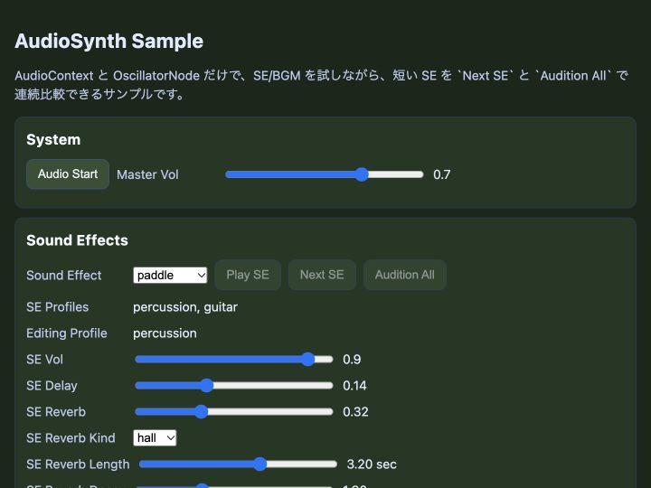

# sound

English | [日本語](README.md)

## Overview

Use `GameAudioSynth` with `AudioSynth` to compare sound effects and background music on one page. After pressing `Audio Start`, play effects or melodies and adjust their volume, timing, envelope, and reverb.

## BGM presets and score format

The sample includes 24 built-in BGM presets: two for each of 12 styles. `Cafe Steps` (112 BPM) is selected at startup. Press `Audio Start`, then `BGM Start`, and choose a melody. Each selection starts the phrase from the beginning and applies its suggested BPM, which you can adjust. Every preset has eight bars in 4/4. BPM is measured in quarter notes, and swing changes the length of paired eighth notes. The jogging styles each include two presets at 170, 175, and 180 BPM.

Scores are defined in `webg/GameMusicPresets.js`: each row represents one bar, with eight positions for eighth notes. Numeric entries are MIDI pitches, `null` sustains the previous note, and `-1` marks a rest. `GameAudioSynth.js` plays the melody, bass, chords, and percussion. Each melody note lasts for its `leadGate` fraction of the interval to the next note, rest, or bar line. If Attack and Decay together exceed that duration, they are shortened proportionally; Release is capped at the note duration, and the melody release also ends by the next onset or rest. The default `setRootHz` value of 220 Hz preserves the written pitches. Changing it transposes the melody, bass, and chords by the same ratio; percussion pitches remain fixed.

The melody uses a low-pass filter to soften strong harmonics, with frequencies above 880 Hz gradually attenuated. Kick, snare, and hi-hat patterns follow each style and share the melody's BPM and swing. Jazz presets use softer percussion; funk and jogging presets have a stronger pulse; ballads and gentle pieces use fewer or quieter hits. Percussion follows BGM volume, delay, and reverb, with its own short envelope independent of the BGM Envelope.

`Melody Vol` scales the lead. `Rhythm Vol` scales the bass, chords, and percussion (0–2, default 1). Set either to zero to compare the parts separately. These values persist when you switch songs and affect newly scheduled notes; notes already playing and effect tails decay naturally. `BGM Vol` controls the overall level.

The score format currently supports eight bars in 4/4, eighth-note positions, and a monophonic lead. It cannot encode sixteenth notes, independent triplets, lead chords, or ties across bar lines. Swing controls the ratio between paired eighth notes. Instruments use basic waveforms and filters rather than recorded instrument samples. Separate part volumes apply to GameAudioSynth scores, not AudioSynth degree-based melodies.

| Style | Preset / BPM | Preset / BPM |
|---|---|---|
| Jazz swing | Cafe Steps · 112 | Corner Quartet · 132 |
| Blues jazz | Blue Room · 96 | Blue Alley · 104 |
| Bossa jazz | Palm Terrace · 126 | Coastal Breeze · 138 |
| Jazz ballad | Midnight Window · 72 | Velvet Rain · 78 |
| Modal jazz | Dorian Walk · 118 | Quartal Horizon · 128 |
| Jazz funk | Sunset Pocket · 108 | Electric Crosswalk · 120 |
| Jogging jazz | River Run · 170 | Boardwalk Miles · 170 |
| Jogging synth | Neon Stride · 175 | Midnight Circuit · 175 |
| Jogging pop | Sunrise Sprint · 180 | Open Road · 180 |
| Upbeat | Daylight · 124 | Market Square · 132 |
| Gentle | Evening · 84 | Moonlit Garden · 90 |
| Tense | Pursuit · 148 | Nightfall Chase · 156 |

## Reading the Screen

The screen is divided into `System`, `Sound Effects`, and `Background Music`. In that order, you first start the `AudioContext`, then adjust sound effects, and finally adjust melody, BPM, BGM envelope, and BGM reverb directly to refine the detailed contour of the BGM.

`System` contains `Audio Start` and `Master Vol`. `Audio Start` is the button that starts `AudioContext` after a user gesture, matching browser restrictions. `Master Vol` is the baseline for the overall volume. Adjusting that first makes it easier to compare the relative balance between sound effects and BGM.

In `Sound Effects`, you choose the effect to play through `Sound Effect`, then play it with `Play SE`. `Next SE` advances through the catalog one item at a time, while `Audition All` plays the full catalog in sequence so you can compare the differences. `SE Profiles` shows the envelope profiles used by that effect, and `Editing Profile` shows the profile currently being edited by the sliders. `SE Vol`, `SE Delay`, `SE Reverb`, `SE Reverb Kind`, `SE Reverb Length`, `SE Reverb Decay`, `SE Envelope`, `SE Attack`, `SE Decay`, `SE Sustain`, and `SE Release` let you change the contour and spatial character of the same sound effect in considerable detail.

In `Background Music`, you work with `BGM Start`, `BGM Stop`, `BGM Vol`, `BPM`, `Melody`, `BGM Delay`, `BGM Reverb`, `BGM Reverb Kind`, `BGM Reverb Length`, `BGM Reverb Decay`, `BGM Attack`, `BGM Decay`, `BGM Sustain`, and `BGM Release`. Unlike a short sound effect, BGM unfolds over time, so adjust it while listening to a full phrase.

## How to Run
- Open [./sound.html](./sound.html) in a browser that supports the Web Audio API.
- Press `Audio Start` before playing a sound; browsers require a user gesture to start audio.

## webg Features Used
- `GameAudioSynth`: handles the game-oriented sound-effect catalog and melody presets together
- `AudioSynth`: handles envelope, delay, reverb, and IR settings for SE and BGM

## Compare the synthesized sound effects

The 18 effects combine short filtered noise, low resonances, continuous pitch changes, and notification phrases. Paddle and wall are brief impacts; block adds debris; baan is an explosion; shupa uses a noise sweep; laser descends in pitch. Poyoon, piyoon, and jump use smooth pitch motion; coin, levelup, and powerup use stable pitches and chords; gameover has a descending phrase. Ui_move and ui_ok are short and quiet enough for repeated input. Effect names and the Play SE controls are preserved.

Noise layers also follow the selected SE Envelope profiles. SE Profiles is generated from the layers actually used, and Editing Profile changes their next playback. Attack and Decay are proportionally shortened to fit brief layers; Release uses the current profile value. Tail_probe combines a short noise onset with sustained tones for envelope and reverb comparisons.

Audition All waits until each effect’s tones and current Release finish, then adds 0.15 seconds before the next effect. You can also keep BGM running to compare the clarity of collision and UI sounds. Delay and reverb tails are not included in the audition wait time.

## Checkpoints
The first thing to do is press `Audio Start`. Once sound output is enabled, use `Sound Effect` and `Play SE` to inspect short effects, then use `BGM Start` to play a melody. If you want to inspect the contour of the sound, change `SE Envelope`. If you want to inspect spatial character, change `SE Reverb Kind`, `SE Reverb Length`, and `SE Reverb Decay`. If you want to inspect the flow of BGM, change `Melody` and `BPM`.

The sample also provides comparison buttons such as `SE Dry / SE Reverb Max` and `BGM Dry / BGM Wet`. If the difference is subtle at a middle slider setting, compare the two extremes, then return to the desired value.

`SE Reverb Kind` and `BGM Reverb Kind` switch between `room`, `hall`, and `plate`. These settings select the character of the reverberation. `Length` describes the length of the IR, and `Decay` describes how quickly it fades. You can compare the full range from a short, tight room to a long, spreading hall.

`SE Envelope` selects the envelope profile for the chosen sound effect. Profiles use names such as `percussion`, `brass`, `woodwind`, `organ`, `piano`, and `guitar`; compare their short attacks, sustained tones, and decays. Changes to `SE Attack`, `SE Decay`, `SE Sustain`, and `SE Release` apply to the next playback. The longer `tail_probe` effect makes the envelope and reverb tail easier to hear.

`BGM Envelope` shapes the attack and tail of each note. Adjust `BGM Attack`, `BGM Decay`, `BGM Sustain`, and `BGM Release` while keeping the melody the same. `BPM` changes the tempo, while `Melody` changes the phrase. The initial BGM reverb is stronger and more hall-like than the SE reverb, making the longer phrase tail easy to hear during `Audition All`.

First, press `Audio Start` and confirm that `Play SE`, `Next SE`, `Audition All`, and `BGM Start` become active. Then switch `Sound Effect` and confirm that `SE Profiles` and `Editing Profile` change to match the selected sound. After that, move `SE Attack`, `SE Decay`, `SE Sustain`, `SE Release`, and `SE Reverb`, replay the same effect, and compare the differences.

When you press `Audition All`, confirm that the entire catalog plays in sequence. If you want to stop it halfway, pressing the same button stops it. `Next SE` advances only one item at a time, which is useful when you want to hear a specific effect once again.

When you switch `SE Reverb Kind` between `room`, `hall`, and `plate`, the reflection texture changes even if the wet amount stays the same. Changing `SE Reverb Length` and `SE Reverb Decay` changes both the length and the falloff of the reverberation. Selecting `tail_probe` makes differences in envelope and reverb tail easier to follow than with shorter sound effects.

On the BGM side, change `Melody`, `BPM`, and `BGM Envelope` to compare how the same phrase sounds at different settings. `BGM Reverb Kind`, `BGM Reverb Length`, and `BGM Reverb Decay` change the apparent space around the melody. Compare the initial hall-like setting with the dry setting, then adjust the controls to find the amount you prefer.

## Controls
Use the on-screen UI buttons and sliders to control this sample.

`Audio Start` starts the `AudioContext`, `BGM Start / BGM Stop` start and stop the BGM, and `Play SE` plays the currently selected sound effect once. `SE Dry / SE Reverb Max` and `BGM Dry / BGM Wet` switch to fixed comparison states.

## Common Pitfalls

Press `Audio Start` to activate the `AudioContext` as required by the browser, then use the other buttons to play sound.

`SE Reverb` and `SE Reverb Kind` are different settings. `SE Reverb` is the amount of reverberation, while `Kind` is the character of the reverberation. The same applies on the BGM side: `BGM Reverb` is the amount and `BGM Reverb Kind` is the character.

`SE Attack` and `BGM Attack` are measured in seconds; `SE Sustain` and `BGM Sustain` are ratios. The displayed values show the units as you move the sliders.

## Related documents

- [UI Design](../../book.en/12_UI.md)
- [Audio Design](../../book.en/16_Audio.md)
- [Introduction](../../book.en/01_Introduction.md)
- [samples/sound/main.js](./main.js)
- [samples/sound/sound.html](./sound.html)

The audio chapter explains the implementation in detail, and the introduction describes the project as a whole. This guide focuses on using the sample's controls.
