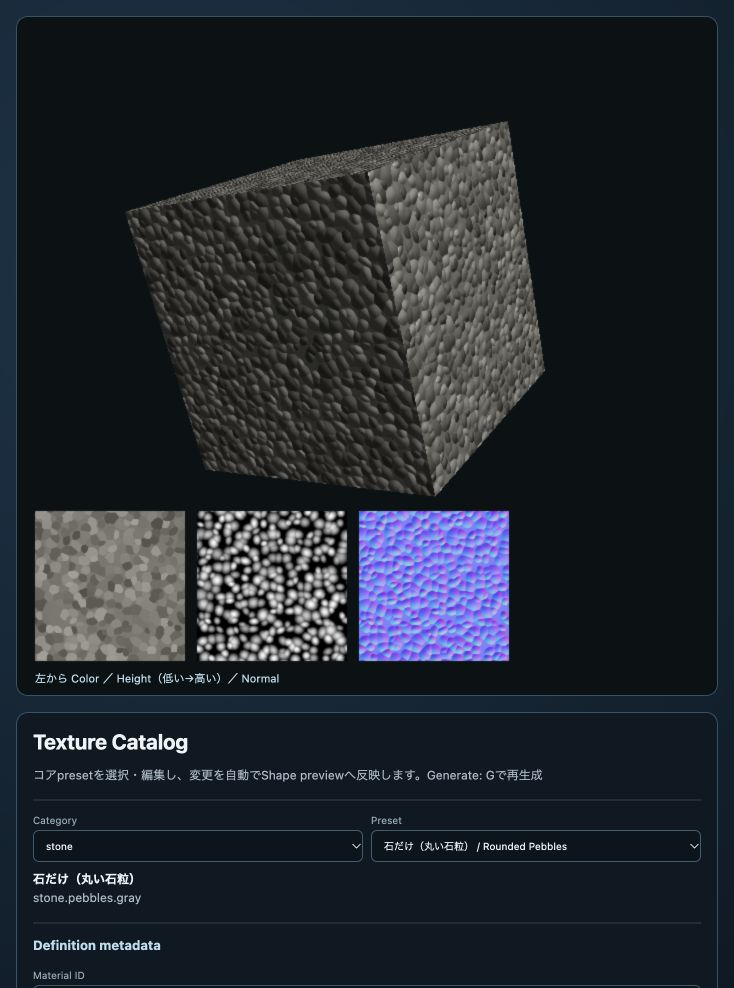

# texture_catalog

[English](README.en.md) | 日本語

## 概要

`texture_catalog`は、webgコアのProcedural Texture presetを選択・編集し、立方体とColor／Height／Normal mapで確認するサンプルです。完成した設定はJavaScriptまたはJSON、生成したColor／Height／Normal mapはPNGまたはJPEGとして保存できます。

## 実行

リポジトリrootでHTTP serverを起動し、`samples/texture_catalog/texture_catalog.html`を開きます。

```sh
python3 -m http.server 8000
```

## 最小API

```js
import ProceduralMaterials from "../../webg/ProceduralMaterials.js";

const materials = new ProceduralMaterials(gpu);
const oak = await materials.createPreset("wood.oak.plank");
oak.applyTo(shape);
```

Shapeは事前にUVを持つ必要があります。同じmaterial handleは複数Shapeへ登録できます。終了時は`materials.destroy()`で生成したGPU resourceを解放します。

## 初期preset

木材、コンクリート、窯業系セメント、レンガ、ビニール、セラミック、樹脂、石材の23 presetを収録しています。13 pattern（柾目、板目、柾目・板目mixを含む）を確認できます。Oak、Walnut、Cedarには板目とmixのpresetがあり、mixはvariation単位で柾目／板目を半数ずつ割り当てます。

## 丸い石粒と砂利

`Category`を`stone`にすると、次の3種類を選べます。

| Preset ID | 内容 |
| --- | --- |
| `stone.pebbles.gray` | 石だけ。丸い大粒、高さ上界40mm |
| `stone.pebbles-gravel.gray` | 石と砂利。石の隙間に高さ6mmの小粒 |
| `stone.gravel.gray` | 砂利だけ。小粒、高さ上界6mm |

いずれも新しい`pebbles` pattern、目地なし、2m四方の周期面です。
`Pattern scale m`は粒の配置尺度で、全粒の直径を同じ値にする指定ではありません。
大粒は0.12m、小粒は0.065mを基準に、半径・縦横比・向きをseedで変えます。

粒の色は暗色・中間色・明色を連続した濃淡から選びます。
`Color amount`は粒の色の濃淡、`Pattern height m`は粒の高さです。
色を薄くしてもHeight／Normalは変わらず、暗い粒も上向きに盛り上がります。
専用欄の「丸み」は0が平頂、1が丸い上面です。丸みを変えてもColor mapは変わりません。
「敷き詰め」は粒の大きさと中心位置のばらつきを調整し、隙間を狭めます。
「配置の乱雑さ」は0〜1で、位置のずれ、粒径、縦横比のばらつきを増やします。
「石だけ」は乱雑さ・粒の密度・敷き詰めを1にし、中央が高い丸い石を密に配置します。
「隙間の砂利の量」は0で大粒だけ、1で隙間へ小粒を合成します。
砂利の配置尺度・高さ・色の濃淡も独立して編集できます。

```js
const stones = await materials.createPreset("stone.pebbles-gravel.gray", {
  tile: {
    pattern: {
      colorAmount: 0.10,
      heightMeters: 0.040,
      pebbles: { roundness: 1, gravelAmount: 1, gravelHeightMeters: 0.006 }
    }
  }
});
stones.applyTo(shape);
```

左下にColor・Height・Normalを並べて表示します。Heightは低い面が暗く、高い面が明るい画像です。
グレースケールは各材質の`heightRangeMeters`に対する値で、物理高さそのものではありません。
`Height range`で復号に必要な範囲を確認でき、`Download Height`で画像も保存できます。
Height／Normalを再利用する場合はPNGを選んでください。

立方体はNormalで起伏を照明へ反映するため、輪郭は変位しません。
実際の起伏へ光線を当てるアプリではHeightを復号し、高さ場の交差に使います。
[設定と実装の詳細](../../docs/sample_development/procedural_pebbles.md)、
[GPU検証](../../unittest/procedural_pebbles/index.html)も参照してください。



## 編集と出力

解像度、Base／Dirt／Joint色、タイル間の色変化、部材寸法、長軸、variation cell、目地、配置、pattern、surface detail、random seed、roughness、specular、metallic、Normal strengthを編集できます。`Thickness m`は部材寸法の参考値としてdefinitionへ保存されますが、手続きテクスチャ生成には使われません。変更は入力と同時にコード表示とGPU textureへ反映されます。`Generate`または`G`キーは、同じdefinitionを手動で再生成する操作です。

`Definition metadata`では、出力する部材の`Material ID`、`Category`、日英の`Label`、`Tile preset ID`を編集できます。最初の`Category`は既存presetを絞り込む選択欄で、Definition metadata内の`Category`が出力definitionへ保存される分類です。既存presetを選択してからこれらの値を変更すると、同じtileとappearanceを元に別の部材definitionを作成できます。

コンクリートの砂による細かなざらつきを試す場合は、`Pattern`の`mottle`を大きな色むらとして残し、`Surface detail scale m`を0.010〜0.0125、`Surface noise height m`を0.00020〜0.00030から調整します。色むらの粗さは`Pattern scale m`、色の強さは`Color amount`、凹凸の強さは`Surface noise height m`で別々に変更できます。`pixelsPerMeter`は細部を記録する画素数を指定します。凹凸の高さは`Surface noise height m`で指定します。200 pixels/mで細部が潰れる場合だけ400 pixels/mを試します。

例えば、fiber cement siding用にmetadataを設定すると、JavaScript出力の先頭は次の形になります。`tile`内の他の設定も画面で編集した完成値が続きます。

```js
export default {
  "id": "fiber.cement.siding",
  "schemaVersion": 1,
  "category": "cement",
  "label": {
    "ja": "窯業系サイディング",
    "en": "Fiber cement siding"
  },
  "tile": {
    "presetId": "fiber.cement.siding",
    // resolution、unit、layout、color、patternなどの完成値
  }
};
```

このsampleはdefinitionファイルを出力します。コアpresetへの登録は別の操作として扱います。出力したdefinitionをコアpresetへ追加または既存presetと入れ替える場合は、内容を確認したうえでコア側へ個別に反映します。

`Layout`の`stack`はRow offsetを0にします。`running-bond`へ変更した時にRow offsetが0なら、違いが見える標準値として1/2へ切り替えます。running-bondのoffsetを0、1/3、1/4へ変更すると、選択した値で再生成されます。

木材presetの初期配置は、Oakが`running-bond`の1/2、Walnutが1/3、Cedarが1/4です。Walnutは1/3の周期を閉じるため、variation cellを2列×6行で生成します。

### 寸法、配置、反射

| 項目 | 変更する内容 |
| --- | --- |
| Pixels per meter | 生成解像度。部材寸法、目地幅、edge roundはこの解像度で整数pixelに揃えられる |
| Long／Short size m | 一部材の長辺と短辺。textureの一周期と実寸Repeatに影響する |
| Thickness mode／Thickness m | 部材厚の参考値。指定してもColor／Height／Normal mapの生成結果は変わらない |
| Long axis | 長辺をtextureの`u`または`v`へ割り当てる方向 |
| Variation columns／rows | texture内で異なる部材variationを配置する数 |
| Joint edge round m | 目地から部材面へ戻る縁の丸み |
| Dirt color／Dirt amount | 部材表面へ加える汚れの色と量 |
| Metallic | PBRマテリアルの金属度 |

### Patternとnoise

| 項目 | 変更する内容 |
| --- | --- |
| Tile color variation | タイルまたは部材ごとの明暗差。0で均一になり、大きいほどタイル間の色変化が強くなる。入力範囲は0～0.25 |
| Pattern scale m | 木理、石目、斑、粒など材質固有patternの基準寸法。小さいほど細かく、大きいほど粗くなる |
| Pattern color amount | patternによるColor mapの明暗振幅 |
| Pattern height m | patternをHeight／Normal mapへ反映する物理的な凹凸振幅 |
| Surface detail scale m | 材質patternとは独立した共通Perlin detailの基準寸法 |
| Surface noise height m | surface detailをHeight／Normal mapへ加える微細な凹凸振幅 |
| Random seed | 部材variation、Perlin noise、Voronoi点、Terrazzo chipなどの配置を変更する再現用整数 |

Patternとsurface detailは別の層です。例えば木理の間隔だけを変える場合は`Pattern scale m`、木理を保ったまま表面の細かなざらつきを変える場合は`Surface detail scale m`と`Surface noise height m`を調整します。同じseedと同じ設定は同じtextureを再生成します。

### 数値の入力とshortcut

すべての数値欄は、右端のspin buttonだけでなく、欄を選択して数値を直接入力できます。数値欄へfocusがある間は↑／↓で次のstepずつ変更します。panel外では↑／↓はcamera操作です。

| 数値欄 | ↑／↓のstep |
| --- | ---: |
| Pixels per meter | 1 |
| Long／Short size、Joint width | 0.005 m |
| Joint edge round | 0.0001 m |
| Joint depth | 0.0001 m |
| Pattern scale、Surface detail scale | 0.0025 m |
| Pattern color amount | 0.005 |
| Pattern height、Surface noise height | 0.00001 m |
| Random seed | 1 |
| Dirt amount | 0.005 |
| Metallic、Roughness、Specular | 0.01 |
| Normal strength | 0.05 |

`G`はGenerate buttonと同じ操作です。Canvas上でも数値欄へfocusがあるときでも使用できます。`Ctrl+G`、`Command+G`、`Alt+G`はbrowser／OS側の操作を優先します。一回の長押しでGenerateを連続実行しません。

数値を直接入力している間はcode表示だけを更新し、入力完了時にGPU textureを生成します。↑／↓のspin buttonも値が確定した時点で生成します。これにより`0.01`のような小数を途中の`0`や`0.`で確定してしまいません。step、min、max、解像度の整数pixel条件から外れた値は、最も近い入力可能な値へ丸め、info欄に変更内容を表示します。
`G`は文字列入力欄とtextareaでは入力文字として扱われ、それ以外のcontrolとCanvasではGenerate shortcutとして動作します。

`Copy Code`と`Download JS`は省略なしの完成definitionをES moduleとして出力します。`Download JSON`も同じdefinitionを保存し、`Import JSON`で再読込できます。数値がstep、min、max、解像度の整数pixel条件から外れる場合は、入力可能な近い値へ丸めてinfo欄へ表示します。

`Texture images`でPNGまたはJPEGを選び、Color・Height・Normal mapを生成元と同じpixel寸法で個別に保存できます。設定変更後に自動生成が完了してからダウンロードしてください。PNGは可逆です。Height／Normal mapを材質へ再利用する場合は、channel値が圧縮で変化しないPNGを使用してください。
