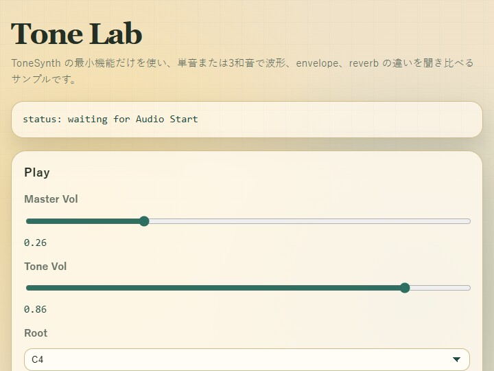

# tone

English | [日本語](README.md)

## Overview
- This sample uses only `ToneSynth` to inspect differences in waveform, envelope, and reverb with either a single note or a triad
- Instead of going through the SE catalog / BGM features of `AudioSynth` or `GameAudioSynth`, it directly manipulates the minimal audio parameters accepted by `ToneSynth.playTone()`
- You can switch between the `sine`, `triangle`, `square`, and `sawtooth` waveforms, the `percussion`, `brass`, `woodwind`, `organ`, `piano`, and `guitar` envelope profiles, and the `room`, `hall`, and `plate` reverb impulses from the same screen

## Reading the Screen

The screen is divided into `Play`, `Envelope`, `Reverb`, and `What To Listen For`. Start by pressing `Audio Start` to start the `AudioContext`, then choose `root`, `wave`, `mode`, and `gain` in `Play`. In `Envelope`, adjust the attack and decay shape of the sound. In `Reverb`, adjust the amount of reverberation and the type of acoustic space.

`Hold Single` plays only the current root while the button is held down. `Hold Triad` plays `root`, `3rd`, and `5th` together while the button is held down. When the button is released, the sound stops according to the release of the selected envelope. When `Mode` is `minor`, it plays a minor triad; otherwise it plays a major triad, so you can compare how the same waveform and envelope sound different as a single note and as a chord.

## How to Run
- Open [./tone.html](./tone.html)
- Use a browser with WebGPU support, and check the help panel and HUD together with the sample when needed

## webg Features Used
- `ToneSynth`: handles single-note playback, stopping, envelope presets, reverb impulses, and volume adjustment
- `ToneSynth.playTone()`: plays one voice by specifying frequency, wave type, profile, gain, and pan. By setting `duration` to `null`, the voice sustains until the button is released
- `ToneSynth.setSeEnvelopePreset()`: updates the currently selected envelope profile from the slider values
- `ToneSynth.setSeReverb()` and `ToneSynth.setSeReverbImpulse()`: switch both the amount of reverb and the character of the impulse response

## Checkpoints
First, press `Audio Start` and confirm that a single note sounds only while `Hold Single` is pressed, then stops with the release phase when the button is released. Next, switch `Wave` from `sine` to `triangle`, `square`, and `sawtooth` and confirm that even with the same envelope, the brightness and hardness change according to harmonic content.

When you switch the `Envelope` profile, the time behavior changes even with the same root and waveform. `percussion` is a short struck sound with almost no sustain, `organ` continues almost steadily, `piano` and `guitar` decay quickly even if held, and `brass` and `woodwind` rise more slowly and are easy to compare as sounds with sustained breath-like behavior. When you move `Attack`, `Decay`, `Sustain`, and `Release`, the changes apply from the next note triggered with the selected profile.

In `Reverb`, switch between `Dry`, `Room`, `Hall`, and `Plate` and confirm how reverberation changes the outline of the sound. With short envelopes, the reverb tail becomes especially noticeable; with long envelopes, the way the dry signal and reverb overlap changes.

When you press `Hold Triad`, it becomes easier to hear reverb smear and the density of harmonics in `square / sawtooth`, which can be hard to judge with a single note. In chords, the voices are also given slightly different pan positions, so the left-right spread can be heard as well.

## Controls
- `Audio Start`: starts the `AudioContext`
- `Hold Single`: plays the root as a single note only while pressed
- `Hold Triad`: plays a major or minor triad only while pressed
- `Stop All`: stops all currently sounding tones with a short release
- `Root`: selects the base note
- `Wave`: selects the `OscillatorNode` waveform
- `Mode`: selects single note, major triad, or minor triad
- `Tone Gain`: adjusts the voice gain passed to `playTone()`
- `Profile`: selects the envelope preset
- `Attack / Decay / Sustain / Release`: adjusts the ADSR of the selected profile
- `Reverb Mix`: adjusts the send and return amount to the convolver together
- `Kind / Length / Decay`: adjusts the character, length, and falloff of the reverb impulse
- `Dry / Room / Hall / Plate`: switches to representative reverb presets

## Common Pitfalls

If you do not press `Audio Start`, no sound will play. This follows browser autoplay restrictions.

`Tone Gain` is the loudness baseline per voice. In a triad, several notes sound together, so the sample lowers each voice slightly to avoid too large a level difference from the single-note case.

If `Reverb Mix` is high and `Release` is long, the direct sound and reverberation overlap and the outline becomes easier to blur. It is easier to hear the differences if you first inspect the envelope in `Dry`, then switch between `Room`, `Hall`, and `Plate`.

## Related Documents

- [18_サウンドの設計.md](../../book/18_サウンドの設計.md)
- [付録C_API一覧.md](../../book/付録C_API一覧.md)
- [samples/tone/main.js](./main.js)
- [samples/tone/tone.html](./tone.html)
