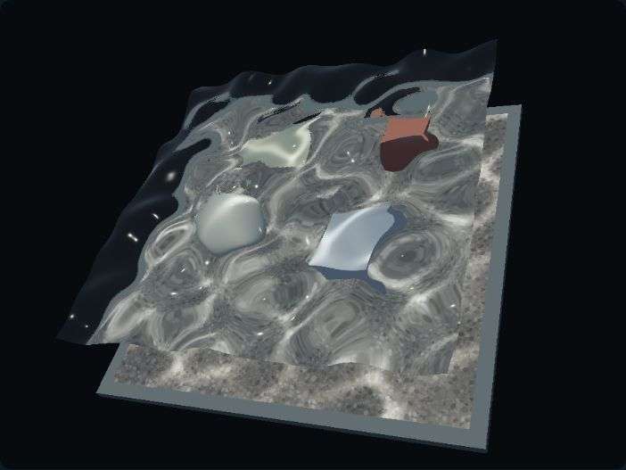

# water — PBRの水面とコースティクス

[English](index.en.html) | 日本語



## 概要

球・箱・斜面と石砂利の底へコースティクスを設定し、同じ波の水面を表示する小さな統合例です。`WaterBody`は水域・波・吸収・受光対象を保持し、`ComputeEffectPipeline.setWater()`がGPU資源と描画順を管理します。シェーダーの置換や描画関数の差し替えは不要です。

## 実行と操作

WebGPU対応ブラウザで[water.html](water.html)を開きます。リポジトリ全体をHTTPで配信し、localhostまたはHTTPSを使います。

1. 「コースティクスを使う」と「水面を表示する」を個別にONにします。
2. 受光対象のチェックを外し、その物体の集光だけが消えることを確認します。
3. 「波を動かす」、球の高さ、品質を変更します。ドラッグで視点を回し、ホイールで拡大できます。
4. 検証ボタンでGPU画像を比較します。描画中の自動readbackはありません。

初期状態は両方OFF、時刻1.5秒で停止です。水面を表示しなくても集光を使えます。青空は既存の`ProceduralEnvironment`で生成し、PBRの環境光と水面反射へ同じ前処理済み環境を渡しています。

## 最小の接続

通常のPBRシーンを先に用意します。集光は垂直なdirectional lightを使用します。低水準pipelineなら、生成時に`lightDirection: [0, -1, 0]`と`shadow: { directional: { up: [0, 0, 1] } }`を指定します。`PbrRenderer`では同じ設定を`pipeline`オプションに入れます。

```js
import WaterBody from "../../webg/WaterBody.js";

const water = new WaterBody({
  origin: [0, 0, 0],   // 照度を投影する基準面の中心。ワールド座標、m
  width: 8, depth: 8,  // 表示・受光する水域のXZ寸法、m
  extent: 20,          // 光線計算の正方形領域。水域より広く取る
  surfaceHeight: 2,    // 平均水面のワールドY、m
  amplitude: 0.15,     // 全成分を合成した波高の上界、m
  waveMix: [1, 0.4, 0.2], // 交差波・うねり・さざ波の相対強度
  absorption: [0.09, 0.035, 0.025] // RGBの吸収係数、1/m
});
water.addReceiver(floorShape);
water.addReceiver(objectNode, { children: true, strength: 0.7 });

// 切替中はframe生成を止める。必要なGPU資源・shaderの準備完了を待つ。
await pipeline.setWater(water, {
  surfaceEnabled: true,
  causticsEnabled: true,
  quality: "low"
});

// frameごとに時刻だけ更新し、通常のrenderScene → encodeを使う。
water.setTime(timeMs / 1000);
```

`PbrRenderer`にも同じ`setWater(water, options)`と`getWaterStats()`があります。`webg/app/index.js`から`WaterBody`をimportすることもできます。水域は現在一つです。

## 変更、対象の解除、OFF

```js
// 高さ・波・色を変更する場合は再接続不要。次のframeで反映する。
water.setOptions({ waveMix: [0.4, 1, 0.3], speed: 0.8 });
water.setOptions({ absorption: [0.07, 0.015, 0.07] }); // 緑系

// Shapeの指定はNodeより優先。強度0でそのShapeだけ除外する。
water.addReceiver(objectShape, { strength: 0 });
water.removeReceiver(objectNode);

await pipeline.setWater(water, {
  surfaceEnabled: false,
  causticsEnabled: true,
  quality: "high"
});

await pipeline.setWater(null); // 全専用GPU資源と追加照明variantを解放
```

`setOptions()`は不正な値を拒否し、それまでの設定を保持します。平均水深は`amplitude`より大きくし、`extent`は水域の幅・奥行き以上にします。`waterlineFade`は水際で集光を混ぜる幅、`wavelength`は波長倍率、`variation`は時間と空間に連続な位相・振幅変調の量、`roughness`は水面のGGX鏡面と環境反射の粗さです。

受光は不透明なShapeとNodeへ設定します。Nodeの`children: false`はそのNode自身に限定します。複数の登録Nodeがある場合は最も近い祖先が優先します。解除やOFFでも対象の形状・材質を保持します。

## 描画への接続

集光は受光面のPBR直接光の拡散成分へ接続します。直接光の鏡面、IBL、局所光、emissiveは既存の経路を保ちます。実際の波の高さで水中を判定するため、球の頂部で固定高さによる輪状の切れ目を作りません。

水面は画面内の深度を使う屈折、IORによるFresnel、RGBのBeer–Lambert吸収、現在のdirectional lightによるGGX鏡面、PBR環境の反射を線形HDRで合成します。水面の手前にある不透明物は、元の表示を保ちます。

Alpha Blendの面とCompute粒子がある場合は水面深度を先に求め、水中のfragmentだけを屈折用背景へ描き、手前のfragmentを水面の後に描きます。粒子のCompute更新は一frameに一度です。Fog、DoF、Bloom、Tone Map、Edgeはその後に適用し、深度・法線を使う効果には水面を含む値を渡します。不透明G-bufferは保持します。

## 品質、負荷、制約

`low`は512²光線・256²照度画像、`high`は1024²光線・512²照度画像です。水面の屈折探索は両品質で48ステップです。停止中の照度画像は再利用し、動く受光物体のmaskだけを更新します。照度生成とmask描画は受光対象を登録した場合に実行します。

両方OFFでは水用のbuffer・texture・QuerySet・描画パスを保持せず、通常の17bindingの照明経路を使います。水面のみONでは水面資源を、集光のみONでは集光資源を用意します。ON時の画面寸法に比例する資源は、リサイズ時に更新します。

`PbrRenderer.createFrameCallbacks()`では計測結果を次のframeで回収します。独自loopでは`queue.submit()`の直後に`pipeline.afterGpuSubmit()`または`renderer.afterGpuSubmit()`を呼びます。

`getWaterStats()`は実行したdispatch/pass数とGPU timestampの非同期測定値を返します。timestamp非対応時は`timing.timestampSupported: false`です。計測区間は照度生成、水面compute、深度転写であり、受光mask・照明variant・透明物の描画を含む全体の追加時間ではありません。`ResourceLedger.js`はQuerySetの個数も追跡します。容量はtexture/bufferの論理容量で、ドライバのcacheや配置まで測る値ではありません。

有限の水平水域を上から見る用途に対応します。水中カメラ、水の側面、複数水域、画面外・物体の裏側の屈折、周囲の物体の鏡像は扱いません。水面交差を得られない画素や、屈折先を探せない画素には元の背景を使います。集光は垂直入射で基準面へ集めた照度を立体へ投影する近似であり、物体の各面へ厳密に光線を追跡する処理ではありません。水中の透明物のFrost・Transmission・Volume吸収を水と重ねた物理的な屈折は、このサンプルの対応範囲外です。

## 読む順序と確認箇所

- `main.js`：通常PBRの準備、`WaterBody`の接続と個別ON/OFF。
- `scene.js`／`floor.js`：受光対象の登録単位と既存Procedural Textureの材質。
- `validation.js`：対象外への漏れ、OFF一致、深度、環境反射、透明面・粒子、リサイズのGPU検証。
- `../../webg/WaterBody.js`：公開設定と受光対象の契約。
- `../../webg/WaterSystem.js`：遅延生成、照度画像の再利用、破棄。

PBRの基本はbook 30〜33章、水面の使い分けは35章です。材質や環境の比較は`pbr_reference`、通常の透明屈折は`transmission`を参照してください。
